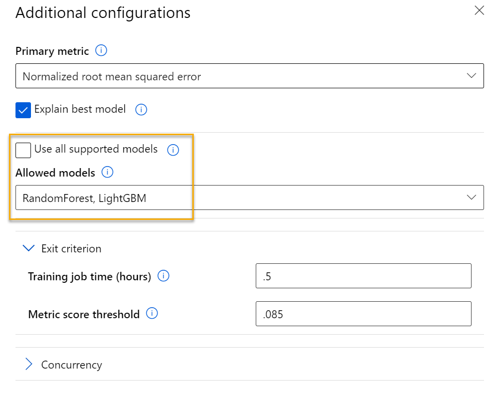
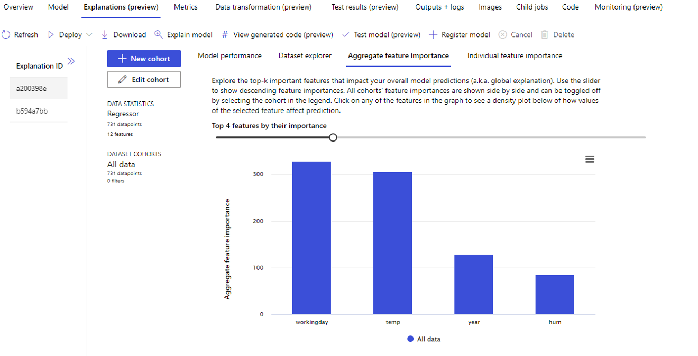
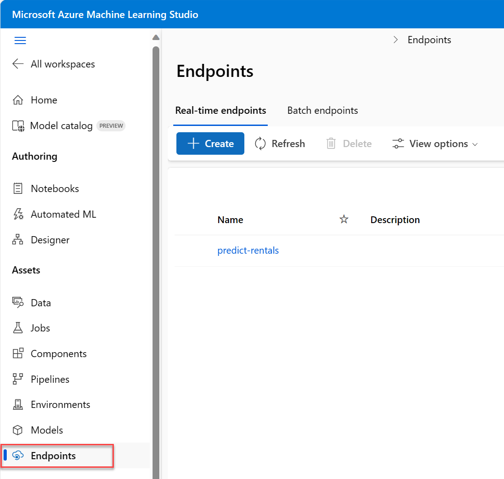

---
lab:
  title: Esplorare la funzionalità di Machine Learning automatizzato in Azure ML
---

# <a name="explore-automated-machine-learning-in-azure-ml"></a>Esplorare la funzionalità di Machine Learning automatizzato in Azure ML

> **Nota** Per completare questo lab, è necessaria una [sottoscrizione di Azure](https://azure.microsoft.com/free?azure-portal=true) in cui si ha accesso amministrativo.

In questo esercizio si userà un set di dati contenente i dettagli cronologici del noleggio di biciclette per eseguire il training di un modello che stima il numero di noleggi di biciclette che dovrebbe essere previsto per un determinato giorno, in base alle caratteristiche stagionali e meteorologiche.

## <a name="create-an-azure-machine-learning-workspace"></a>Creare un'area di lavoro di Machine Learning di Azure  

1. Accedere al [portale di Azure](https://portal.azure.com?azure-portal=true) usando le proprie credenziali Microsoft.

1. Selezionare **+ Crea una risorsa**, cercare *Machine Learning* e creare una nuova risorsa **Azure Machine Learning** con un piano di *Azure Machine Learning*. Usare le seguenti impostazioni:
    - **Sottoscrizione**: *la sottoscrizione di Azure usata*.
    - **Gruppo di risorse**: *creare o selezionare un gruppo di risorse*.
    - **Nome area di lavoro**: *immettere un nome univoco per l'area di lavoro*.
    - **Area**: *selezionare l'area geografica più vicina*.
    - **Account di archiviazione**: *prendere nota del nuovo account di archiviazione predefinito che verrà creato per l'area di lavoro*.
    - **Insieme di credenziali delle chiavi**: *prendere nota del nuovo insieme di credenziali delle chiavi predefinito che verrà creato per l'area di lavoro*.
    - **Application Insights**: *prendere nota della nuova risorsa Application Insights predefinita che verrà creata per l'area di lavoro*.
    - **Registro contenitori**: Nessuno (*ne verrà creato uno automaticamente la prima volta che si distribuisce un modello in un contenitore*).

1. Selezionare **Rivedi e crea** e quindi **Crea**. Attendere che l'area di lavoro venga creata (l'operazione può richiedere alcuni minuti) e quindi passare alla risorsa distribuita.

1. Selezionare **Avvia studio** (in alternativa, aprire una nuova scheda nel browser e passare a [https://ml.azure.com](https://ml.azure.com?azure-portal=true)) e accedere allo studio di Azure Machine Learning usando il proprio account Microsoft.

1. Se viene visualizzato un messaggio simile a **Quali sono i tuoi obiettivi di Machine Learning oggi?** , selezionare **Annulla**.

1. Se viene visualizzato il messaggio **Benvenuti nello studio**, selezionare **X**.

1. Nello studio di Azure Machine Learning verrà visualizzata l'area di lavoro appena creata. In caso contrario, fare clic su **Microsoft** nel menu a sinistra. Dal nuovo menu a sinistra selezionare quindi **Aree di lavoro**, dove vengono elencate tutte le aree di lavoro associate alla sottoscrizione. Scegliere quella creata per questo esercizio. 

> **Nota** Questo modulo è uno dei molti che usano un'area di lavoro di Azure Machine Learning, inclusi gli altri moduli nel percorso di apprendimento [Elementi fondamentali di Microsoft Azure per intelligenza artificiale: Esplorare gli strumenti visivi per Machine Learning](https://docs.microsoft.com/learn/paths/create-no-code-predictive-models-azure-machine-learning/). Se si usa la propria sottoscrizione di Azure, è consigliabile creare l'area di lavoro una sola volta e riutilizzarla negli altri moduli. Alla sottoscrizione di Azure verrà addebitato un importo ridotto per l'archiviazione dei dati, fintanto che l'area di lavoro di Azure Machine Learning è presente nella sottoscrizione. È quindi consigliabile eliminare l'area di lavoro di Azure Machine Learning quando non è più necessaria.

## <a name="create-compute"></a>Creare l'ambiente di calcolo

1. Nello [studio di Azure Machine Learning](https://ml.azure.com?azure-portal=true) selezionare le tre righe in alto a sinistra per visualizzare le diverse pagine dell'interfaccia. Potrebbe essere necessario ingrandire le dimensioni della schermata. Queste pagine situate nel riquadro a sinistra consentono di gestire le risorse nell'area di lavoro. Selezionare la pagina **Calcolo** (in **Gestisci**).

1. Nella pagina **Calcolo** selezionare la scheda **Cluster di elaborazione** e aggiungere un nuovo cluster di elaborazione con le impostazioni specificate di seguito. Il cluster sarà usato per eseguire il training di un modello di Machine Learning.
    - **Località**: *selezionare la stessa località dell'area di lavoro. Se la località non è nell'elenco, scegliere quella più vicina alla propria posizione*.
    - **Livello macchina virtuale**: Dedicato
    - **Tipo di macchina virtuale**: CPU
    - **Dimensioni macchina virtuale**:
        - Scegliere **Selezionare da tutte le opzioni**
        - Cercare e selezionare **Standard_DS11_v2**
    - Selezionare **Avanti**
    - **Nome dell'ambiente di calcolo**: *immettere un nome univoco*.
    - **Numero minimo di nodi**: 0
    - **Numero massimo di nodi**: 2
    - **Secondi di inattività prima della riduzione delle prestazioni**: 120
    - **Abilita accesso SSH**: deselezionare l'opzione
    - Selezionare **Crea**

> **Nota** Le istanze di ambiente di calcolo e i cluster di elaborazione sono basati su immagini di macchine virtuali di Azure standard. Per questo modulo, è consigliabile usare l'immagine *Standard_DS11_v2* per ottenere un equilibrio ottimale tra costi e prestazioni. Se la quota della sottoscrizione in uso non include questa immagine, scegliere un'immagine alternativa, ma tenere presente che un'immagine superiore può generare costi più elevati e un'immagine inferiore potrebbe non essere sufficiente per completare le attività. In alternativa, chiedere all'amministratore di Azure di estendere la quota.

La creazione del cluster di elaborazione potrebbe richiedere diversi minuti. Durante l'attesa, è possibile procedere con il passaggio successivo.

## <a name="create-a-dataset"></a>Creare un set di dati

1. Visualizzare i dati delimitati da virgole in [https://aka.ms/bike-rentals](https://aka.ms/bike-rentals?azure-portal=true) nel Web browser.

1. In [studio di Azure Machine Learning](https://ml.azure.com?azure-portal=true), espandere il riquadro sinistro selezionando le tre righe in alto a sinistra della schermata. Visualizzare la pagina **Dati** (in **Asset**). La pagina Dati contiene tabelle o file di dati specifici che si prevede di usare in Azure ML. Da questa pagina è anche possibile creare set di dati.

1. Nella pagina **Dati**, nella scheda **Asset di dati** selezionare **Crea**. Configurare quindi un asset dati con le impostazioni seguenti:
    * **Tipo di dati**:
        * **Nome**: noleggi di biciclette
        * **Descrizione**: dati noleggio biciclette
        * **Dataset type** (Tipo di set di dati): tabulare
    * **Origine dati**: da file Web
    * **Web URL** (URL Web): 
        * **URL Web**: [https://aka.ms/bike-rentals](https://aka.ms/bike-rentals?azure-portal=true)
        * **Ignora convalida dei dati**: *non selezionare*
    * **Impostazioni**:
        * **Formato di file**: delimitato
        * **Delimitatore**: virgola
        * **Codifica**: UTF-8
        * **Intestazioni colonna**: solo il primo file ha intestazioni
        * **Ignora righe**: Nessuno
        * **Il set di dati contiene dati su più righe**: *non selezionare*
    * **Schema**:
        * Includi tutte le colonne diverse da **Path**
        * Rivedi i tipi rilevati automaticamente
    * **Verifica**
        * Selezionare **Crea**

1. Dopo aver creato il set di dati, aprirlo e visualizzare la pagina **Esplora** per visualizzare un esempio dei dati. Questi dati contengono funzionalità ed etichette cronologiche dei noleggi di biciclette.

> **Citazione**: *Questi dati sono derivati da [Capital bikeshare](https://www.capitalbikeshare.com/system-data) e vengono usati in conformità con il [contratto di licenza](https://www.capitalbikeshare.com/data-license-agreement) dei dati pubblicati*.

## <a name="run-an-automated-machine-learning-job"></a>Eseguire un processo di Machine Learning automatizzato

Attenersi alla procedura seguente per eseguire un processo che usa Machine Learning automatizzato per eseguire il training di un modello di regressione che consente di prevedere i noleggi di biciclette.

1. In [Azure Machine Learning Studio](https://ml.azure.com?azure-portal=true) visualizzare la pagina **ML automatizzato** (disponibile in **Autore**).

1. Creare un processo di ML automatizzato con le impostazioni seguenti:
    - **Selezionare l'asset di dati**:
        - **Set di dati**: noleggi di biciclette
    - **Configurare processo**:
        - **Nome nuovo esperimento**: mslearn-bike-rental
        - **Colonna di destinazione**: noleggi (*questa è l'etichetta per la cui previsione viene eseguito il training del modello)*
        - **Selezionare cluster di elaborazione di Azure ML**: *il cluster di elaborazione creato in precedenza*.
    - **Selezionare attività e impostazioni**: 
        - **Tipo di attività**: Regressione *(il modello prevede un valore numerico)* 

    

    Si noti che in Tipo di attività sono presenti le impostazioni *Visualizza impostazioni di configurazione aggiuntive* e *Visualizza impostazioni di definizione delle funzionalità*. Configurare ora queste impostazioni.

    - **Impostazioni aggiuntive per la configurazione**:
        - **Metrica primaria**: selezionare **Radice normalizzata dell'errore quadratico medio**
        - **Modello esplicativo migliore**: selezionato. *Questa opzione fa in modo che il Machine Learning automatizzato calcoli l'importanza della funzionalità per il modello migliore, rendendo possibile determinare l'influenza di ogni funzionalità nell'etichetta stimata.*
        - **Usare tutti i modelli supportati**: <u>deselezionato</u>. *Durante il processo si proveranno solo alcuni algoritmi specifici.*
        - **Modelli consentiti**: *selezionare solo **RandomForest** e **LightGBM**. Normalmente si vorrà provare il maggior numero possibile di modelli, ma ogni modello aggiunto aumenta il tempo necessario per eseguire il processo.*

        
        - **Criterio di uscita**:
            - **Durata del processo di training (ore)** : 0,5. *Il processo terminerà dopo un massimo di 30 minuti.*
            - **Soglia di punteggio metrica**: 0,085. *Se un modello raggiunge un punteggio della metrica Radice normalizzata dell'errore quadratico medio di 0,085 o inferiore, il processo termina.*
        - **Concorrenza**: *non modificare*
    - **Impostazioni di definizione delle funzionalità:**
        - **Abilita definizione delle funzionalità**: selezionato. *Consente di eseguire la pre-elaborazione automatica delle funzionalità prima del training.*

    Fare clic su **Avanti** per passare al riquadro di selezione successivo.

    - **Selezionare il tipo di convalida e di test**
        - **Tipo di convalida**: automatica
        - **Test dell'asset dati (anteprima)** : nessun asset di dati di test richiesto

1. Al termine dell'invio dei dettagli del processo di Machine Learning automatizzato, l'avvio viene eseguito automaticamente. Attendere che lo stato cambi da *In preparazione* a *In esecuzione*.

1. Quando lo stato passa a *In esecuzione*, visualizzare la scheda **Modelli** e osservare mentre viene provata ogni combinazione possibile di algoritmi di training e passaggi di pre-elaborazione e vengono valutate le prestazioni del modello risultante. La pagina viene aggiornata automaticamente a intervalli regolari, ma è anche possibile selezionare **Aggiorna**. Potrebbero essere necessari circa dieci minuti per della comparsa dei primi modelli, perché prima di poter iniziare il training occorre inizializzare i nodi del cluster.

1. Attendere il completamento del processo. L'operazione potrebbe richiedere un po' di tempo.

## <a name="review-the-best-model"></a>Esaminare il modello migliore

1. Nella scheda **Panoramica** del processo di Machine Learning automatizzato prendere nota del riepilogo del modello migliore.
    

    >[!NOTE]
    > È possibile che sotto lo stato venga visualizzato un messaggio simile ad "Avviso: punteggio di uscita specificato dall'utente raggiunto...". Si tratta di un messaggio previsto. Continuare con il passaggio successivo.  
1. Selezionare il testo in **Nome dell'algoritmo** per il modello migliore per visualizzarne i dettagli.

1. Accanto al valore *Radice normalizzata dell'errore quadratico medio* selezionare **Visualizza tutte le altre metriche** per visualizzare i valori di altre metriche di valutazione possibili per un modello di regressione.

    

1. Selezionare la scheda **Metriche** e selezionare i grafici **residui** e **predicted_true**, se non sono già selezionati. 
    

    Esaminare i grafici che mostrano le prestazioni del modello. Il primo grafico mostra i *residui*, ovvero le differenze tra valori previsti ed effettivi, come istogramma. Il secondo grafico confronta i valori previsti con i valori reali.

1. Selezionare la scheda **Spiegazioni**. Selezionare un ID spiegazione e quindi visualizzare la pagina **Importanza delle caratteristiche aggregate**. Questo grafico mostra il livello di influenza di ogni caratteristica del set di dati sulla stima dell'etichetta, come illustrato di seguito:

    

## <a name="deploy-a-predictive-service"></a>Distribuire un servizio predittivo

1. Nello [studio di Azure Machine Learning](https://ml.azure.com?azure-portal=true) nella pagina **ML automatizzato** selezionare il processo di Machine Learning automatizzato.

1. Nella scheda **Panoramica** selezionare il nome dell'algoritmo per il modello migliore.

    

1. Nella scheda **Modelli** selezionare il pulsante **Distribuisci** e usare l'opzione **Distribuisci in servizio Web** per distribuire il modello con le impostazioni seguenti:
    - **Nome**: previsione-noleggi
    - **Descrizione**: prevedere i noleggi di biciclette
    - **Tipo di ambiente di calcolo**: Istanza di Azure Container
    - **Abilita autenticazione**: Opzione selezionata

1. Attendere l'avvio della distribuzione. L'operazione potrebbe richiedere alcuni secondi. Quindi, nella sezione di **Riepilogo modelli** osservare lo **Stato di distribuzione** per il servizio **previsione-noleggi**, che deve essere **In esecuzione**. Attendere che questo stato venga modificato in **Operazione riuscita**. Tale operazione potrebbe richiedere tempo. Potrebbe essere necessario selezionare periodicamente **Aggiorna**.

1. In studio di Azure Machine Learning, nel menu a sinistra selezionare **Endpoint**.
    

## <a name="test-the-deployed-service"></a>Testare il servizio distribuito

A questo punto è possibile testare il servizio distribuito.

1. Nella pagina **Endpoint** aprire l'endpoint in tempo reale **predict-rentals**.

1. Quando viene aperto l'endpoint **predict-rentals**, visualizzare la scheda **Test**.

1. Nel riquadro **Dati di input per testare l'endpoint in tempo reale** sostituire il codice JSON del modello con i dati di input seguenti:

    ```JSON
    {
      "Inputs": { 
        "data": [
          {
            "day": 1,
            "mnth": 1,   
            "year": 2022,
            "season": 2,
            "holiday": 0,
            "weekday": 1,
            "workingday": 1,
            "weathersit": 2, 
            "temp": 0.3, 
            "atemp": 0.3,
            "hum": 0.3,
            "windspeed": 0.3 
          }
        ]    
      },   
      "GlobalParameters": 1.0
    }
    ```

1. Fare clic sul pulsante **Test**.

1. Esaminare i risultati dei test, che includono un numero stimato dei noleggi in base alle caratteristiche di input. Il riquadro di test ha considerato i dati di input e ha usato il modello sottoposto a training per restituire il numero stimato di noleggi.

    

Di seguito vengono descritte le operazioni eseguite. È stato usato un set di dati cronologici relativi al noleggio di biciclette per eseguire il training di un modello. Il modello stima il numero di noleggi di biciclette previsti in un determinato giorno, in base a *caratteristiche* stagionali e meteorologiche. In questo caso, le *etichette* sono il numero di noleggi di biciclette.

È stato appena testato un servizio pronto per essere connesso a un'applicazione client usando le credenziali nella scheda **Utilizza**. Il lab termina qui. È possibile continuare a fare pratica con il servizio appena distribuito.

## <a name="clean-up"></a>Eliminazione

Il servizio Web creato è ospitato in un'*Istanza di contenitore di Azure*. Se non si vogliono eseguire altri esperimenti con tale servizio, è consigliabile eliminare l'endpoint per evitare di accumulare tempi di utilizzo superflui per Azure. È anche opportuno arrestare l'istanza di ambiente di calcolo fino a quando non sarà nuovamente necessaria.

1. In [Azure Machine Learning Studio](https://ml.azure.com?azure-portal=true) nella scheda **Endpoint** selezionare l'endpoint **previsione-noleggi**. Selezionare quindi **Elimina** e confermare l'eliminazione dell'endpoint.
2. Nella pagina **Calcolo**, nella scheda **Istanze di ambiente di calcolo**, selezionare l'istanza di ambiente di calcolo e quindi **Arresta**.

>[!NOTE]
> L'arresto delle risorse di calcolo garantisce che alla sottoscrizione non vengano addebitati i costi di calcolo corrispondenti. Verrà tuttavia addebitato un importo ridotto per l'archiviazione dei dati, fintanto che l'area di lavoro di Azure Machine Learning è presente nella sottoscrizione. Se è stata completata l'esplorazione di Azure Machine Learning, è possibile eliminare l'area di lavoro di Azure Machine Learning e le risorse associate. Tuttavia, se si prevede di completare qualsiasi altro lab in questa serie, sarà necessario ricrearla.
>
> Per eliminare l'area di lavoro:
> 1. Nel [portale di Azure](https://portal.azure.com?azure-portal=true), nella pagina **Gruppi di risorse**, aprire il gruppo di risorse specificato durante la creazione dell'area di lavoro di Azure Machine Learning.
> 2. Fare clic su **Elimina gruppo di risorse**, digitare il nome del gruppo di risorse per confermare che si vuole eliminarlo e quindi selezionare **Elimina**.