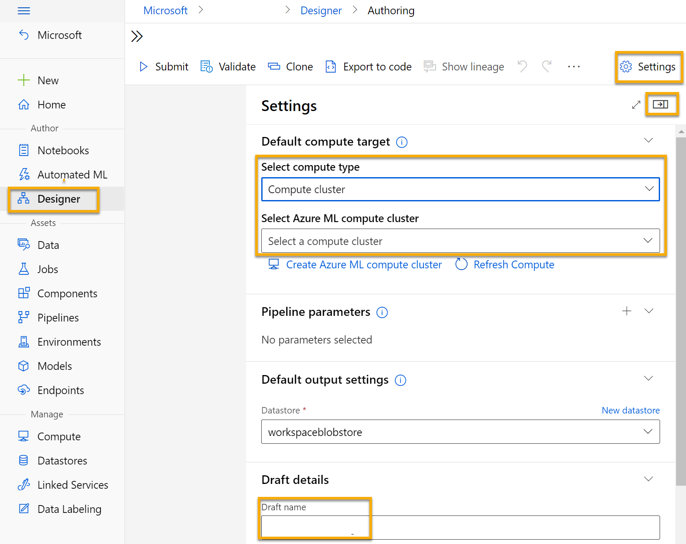
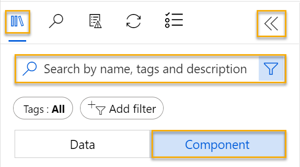
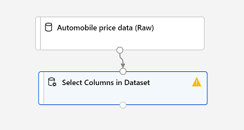
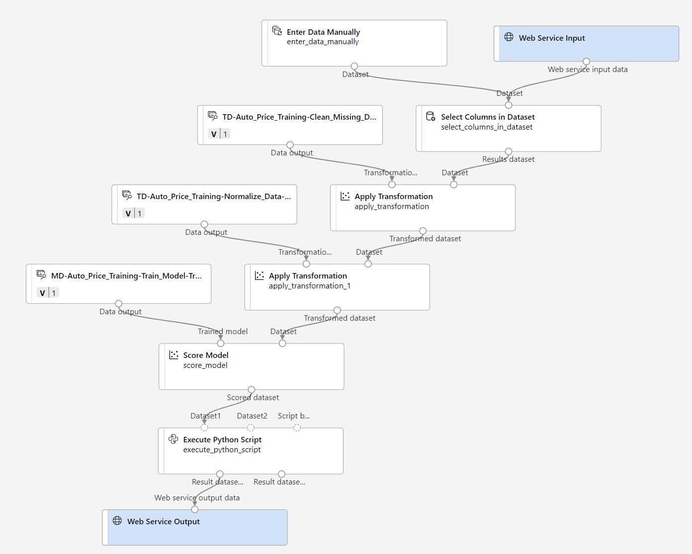

---
lab:
  title: Esplorare la regressione con la finestra di progettazione di Azure Machine Learning
---

# Esplorare la regressione con la finestra di progettazione di Azure Machine Learning

> **Nota** Per completare questo lab, è necessaria una [sottoscrizione di Azure](https://azure.microsoft.com/free?azure-portal=true) in cui si ha accesso amministrativo.

In questa esercitazione si eseguirà il training di un modello di regressione che stima il prezzo di un'automobile in base alle relative caratteristiche.

## Creare un'area di lavoro di Machine Learning di Azure  

1. Accedere al [portale di Azure](https://portal.azure.com?azure-portal=true) usando le proprie credenziali Microsoft.

1. Selezionare **+ Crea una risorsa**, cercare *Machine Learning* e creare una nuova risorsa **Azure Machine Learning** con un piano di *Azure Machine Learning*. Usare le seguenti impostazioni:
    - **Sottoscrizione**: *la sottoscrizione di Azure usata*.
    - **Gruppo di risorse**: *creare o selezionare un gruppo di risorse*.
    - **Nome area di lavoro**: *immettere un nome univoco per l'area di lavoro*.
    - **Area**: *selezionare l'area geografica più vicina*.
    - **Account di archiviazione**: *prendere nota del nuovo account di archiviazione predefinito che verrà creato per l'area di lavoro*.
    - **Insieme di credenziali delle chiavi**: *prendere nota del nuovo insieme di credenziali delle chiavi predefinito che verrà creato per l'area di lavoro*.
    - **Application Insights**: *prendere nota della nuova risorsa Application Insights predefinita che verrà creata per l'area di lavoro*.
    - **Registro contenitori**: Nessuno (*ne verrà creato uno automaticamente la prima volta che si distribuisce un modello in un contenitore*)

1. Selezionare **Rivedi e crea** e quindi **Crea**. Attendere che l'area di lavoro venga creata (l'operazione può richiedere alcuni minuti) e quindi passare alla risorsa distribuita.

1. Selezionare **Avvia studio** (in alternativa, aprire una nuova scheda nel browser e passare a [https://ml.azure.com](https://ml.azure.com?azure-portal=true)) e accedere allo studio di Azure Machine Learning usando il proprio account Microsoft.

1. Nello studio di Azure Machine Learning verrà visualizzata l'area di lavoro appena creata. In caso contrario, selezionare la directory di Azure nel menu a sinistra. Quindi, dal nuovo menu a sinistra selezionare **Aree di** lavoro, in cui sono elencate tutte le aree di lavoro associate alla directory e selezionare quella creata per questo esercizio.

> **Nota** Questo modulo è uno dei molti che usano un'area di lavoro di Azure Machine Learning, inclusi gli altri moduli nel percorso di apprendimento [Elementi fondamentali di Microsoft Azure per intelligenza artificiale: Esplorare gli strumenti visivi per Machine Learning](https://docs.microsoft.com/learn/paths/create-no-code-predictive-models-azure-machine-learning/). Se si usa la propria sottoscrizione di Azure, è consigliabile creare l'area di lavoro una sola volta e riutilizzarla negli altri moduli. Alla sottoscrizione di Azure verrà addebitato un importo ridotto per l'archiviazione dei dati, fintanto che l'area di lavoro di Azure Machine Learning è presente nella sottoscrizione. È quindi consigliabile eliminare l'area di lavoro di Azure Machine Learning quando non è più necessaria.

## Creare l'ambiente di calcolo

1. In [studio di Azure Machine Learning](https://ml.azure.com?azure-portal=true) selezionare l'icona **&#8801;** (un'icona di menu simile a uno stack di tre righe) in alto a sinistra per visualizzare le varie pagine nell'interfaccia (potrebbe essere necessario ingrandire le dimensioni dello schermo). Queste pagine situate nel riquadro a sinistra consentono di gestire le risorse nell'area di lavoro. Selezionare la pagina **Calcolo** (in **Gestisci**).

1. Nella pagina **Calcolo** selezionare la scheda **Cluster di elaborazione** e aggiungere un nuovo cluster di elaborazione con le impostazioni seguenti per eseguire il training di un modello di Machine Learning:
    - **Località**: *selezionare la stessa località dell'area di lavoro. Se la località non è nell'elenco, scegliere quella più vicina alla propria posizione*.
    - **Livello macchina virtuale**: Dedicato
    - **Tipo di macchina virtuale**: CPU
    - **Dimensioni macchina virtuale**:
        - Scegliere **Selezionare da tutte le opzioni**
        - Cercare e selezionare **Standard_DS11_v2**
    - Selezionare **Avanti**
    - **Nome dell'ambiente di calcolo**: *immettere un nome univoco*
    - **Numero minimo di nodi**: 0
    - **Numero massimo di nodi**: 2
    - **Secondi di inattività prima della riduzione delle prestazioni**: 120
    - **Abilita accesso SSH**: deselezionare l'opzione
    - Selezionare **Crea**

> **Nota** Le istanze di ambiente di calcolo e i cluster di elaborazione sono basati su immagini di macchine virtuali di Azure standard. Per questo modulo, è consigliabile usare l'immagine *Standard_DS11_v2* per ottenere un equilibrio ottimale tra costi e prestazioni. Se la quota della sottoscrizione in uso non include questa immagine, scegliere un'immagine alternativa, ma tenere presente che un'immagine superiore può generare costi più elevati e un'immagine inferiore potrebbe non essere sufficiente per completare le attività. In alternativa, chiedere all'amministratore di Azure di estendere la quota.

La creazione del cluster di elaborazione potrebbe richiedere diversi minuti. Mentre il processo di creazione è in corso, è possibile procedere con il passaggio successivo.

## Creare una pipeline nella finestra di Progettazione 

1. In [studio di Azure Machine Learning](https://ml.azure.com?azure-portal=true) espandere il riquadro sinistro selezionando l'icona del menu in alto a sinistra della schermata. Visualizzare la pagina della **finestra di progettazione** (in **Autore**) e selezionare **+** per creare una nuova pipeline.

1. Nella parte superiore destra della schermata, selezionare **Impostazioni**. Se il riquadro **Impostazioni** non è visibile, selezionare l'icona a forma di ingranaggio accanto al nome della pipeline nella parte superiore.

1. In **Impostazioni** è necessario specificare una destinazione di calcolo in cui eseguire la pipeline. In **Seleziona tipo di calcolo**, selezionare **Cluster di elaborazione**. Quindi in **Selezionare cluster di elaborazione di Azure ML** selezionare il cluster di elaborazione creato in precedenza.

1. In **Impostazioni**, in **Dettagli bozza** modificare il nome della bozza (**Pipeline-Created-on-* date***) in **Training prezzi automatici**.

1. Selezionare l'icona *di chiusura* in alto a destra del riquadro **Impostazioni** per chiudere il riquadro. 



## Aggiungere ed esplorare un set di dati

Azure Machine Learning include un set di dati di esempio che è possibile utilizzare per il modello di regressione.

1. Accanto al nome della pipeline a sinistra selezionare l'icona con le frecce per espandere il pannello, se non è già espanso. Il pannello si dovrebbe aprire per impostazione predefinita sul riquadro **Libreria**, indicato dall'icona dei libri nella parte superiore del pannello. È disponibile una barra di ricerca per individuare gli asset nel riquadro e due pulsanti, **Dati** e **Componenti**.

    

1. Fare clic su **Componente**. Cercare il set di dati **Automobile price data (Raw)** e posizionarlo sul canvas.

1. Fare clic con il pulsante destro del mouse (CTRL+clic su un Mac) sul set di dati **Automobile price data (Raw)** nel canvas e fare clic su **Anteprima dei dati**.

1. Esaminare lo schema *Output del set di dati* dei dati tenendo presente che è possibile visualizzare le distribuzioni delle varie colonne sotto forma di istogrammi.

1. Scorrere verso destra il set di dati finché non viene visualizzata la colonna **Price**, ovvero l'etichetta prevista dal modello.

1. Scorrere indietro a sinistra e selezionare l'intestazione di colonna **normalized-losses**. Esaminare quindi le statistiche per questa colonna. Notare che in questa colonna mancano alcuni valori. I valori mancanti limitano l'utilità della colonna per la previsione dell'etichetta **price**, quindi potrebbe essere opportuno escluderla dal training.

1. Chiudere la finestra di **visualizzazione dei risultati di Automobile price data (Raw)** per visualizzare il set di dati all'interno dell'area di disegno, nel modo seguente:

    

## Aggiungere trasformazioni di dati

Le trasformazioni dei dati vengono in genere applicate con lo scopo di preparare i dati per la modellazione. Nel caso dei dati relativi al prezzo dell'automobile, si aggiungeranno trasformazioni per risolvere i problemi identificati durante l'esplorazione dei dati.

1. Nel riquadro **Libreria** a sinistra fare clic su **Componente** per accedere a un'area in cui è inclusa un'ampia gamma di moduli che è possibile usare per la trasformazione dei dati e il training del modello. È anche possibile usare la barra di ricerca per individuare rapidamente i moduli.

1. Cercare un modulo **Select Columns in Dataset** e posizionarlo sul canvas, sotto il modulo **Automobile price data (Raw)**. Collegare quindi l'output nella parte inferiore del modulo **Automobile price data (Raw)** all'input nella parte superiore del modulo **Select Columns in Dataset**, in questo modo:

    

1. Fare doppio clic sul modulo **Select Columns in Dataset** per accedere a un riquadro delle impostazioni a destra. Selezionare **Modifica colonna**. Nella finestra **Seleziona colonne** selezionare **Per nome** e **Aggiungi tutto** per aggiungere tutte le colonne. Rimuovere quindi **normalized-losses**, in modo che la selezione finale della colonna abbia un aspetto simile al seguente:

    

1. Fare clic sul pulsante **Save** (Salva).

Nella parte restante di questo esercizio verranno eseguiti i passaggi per creare una pipeline simile alla seguente:


Eseguire i passaggi successivi usando l'immagine come riferimento per l'aggiunta e la configurazione dei moduli richiesti.

1. In **Libreria** cercare un modulo **Clean Missing Data** e posizionarlo sotto il modulo **Select Columns in Dataset** sul canvas. Collegare quindi l'output del modulo **Select Columns in Dataset** all'input del modulo **Clean Missing Data**.

1. Fare doppio clic sul modulo **Clean Missing Data** e nel riquadro a destra fare clic su **Modifica colonna**. Quindi, selezionare **Con regole** nella finestra **Colonne da pulire**, scegliere **Nomi colonne** dall'elenco **Includi** e immettere**bore**, **stroke** e **horsepower** nella casella dei nomi delle colonne, come indicato di seguito:

    

1. Mantenere selezionato il modulo **Clean Missing Data** e nel riquadro a destra specificare le impostazioni di configurazione seguenti:
    - **Minimum missing value ratio** (Rapporto minimo valori mancanti): 0.0
    - **Maximum missing value ratio** (Rapporto massimo valori mancanti): 1,0
    - **Cleaning mode** (Modalità di pulizia): Remove entire row (Rimuovi intera riga)

    >**Suggerimento** Se si esaminano le statistiche relative alle colonne **bore**, **stroke** e **horsepower**, si noterà un certo numero di valori mancanti. Queste colonne contengono un numero di valori mancanti minore rispetto alla colonna **normalized-losses**. Di conseguenza, escludendo le righe dei valori mancanti dal training, potrebbero rilevarsi utili per la previsione di **price**.

1. In **Libreria** cercare un modulo **Normalize Data** e posizionarlo sul canvas, sotto il modulo **Clean Missing Data**. Collegare quindi l'output più a sinistra del modulo **Clean Missing Data** all'input del modulo **Normalize Data**.

1. Fare doppio clic sul modulo **Normalize Data** per visualizzare il relativo riquadro dei parametri. È necessario specificare il metodo di trasformazione e le colonne da trasformare. Impostare il metodo di trasformazione su **MinMax**. Applicare una regola selezionando **Modifica colonna** in modo da includere i **nomi di colonna** seguenti:
    - **symboling**
    - **wheel-base**
    - **length**
    - **width**
    - **height**
    - **curb-weight**
    - **engine-size**
    - **bore**
    - **stroke**
    - **compression-ratio**
    - **horsepower**
    - **peak-rpm**
    - **city-mpg**
    - **highway-mpg**

    

    >**Suggerimento** Se si confrontano i valori nelle colonne **stroke**, **peak-rpm** e **city-mpg**, si noterà che tutte queste colonne sono misurate in scale diverse ed è possibile che i valori più grandi della colonna **peak-rpm** sbilancino l'algoritmo di training e determinino una dipendenza eccessiva da tale colonna rispetto alle colonne con valori più bassi, ad esempio **stroke**. In genere, i data scientist mitigano questa possibile distorsione *normalizzando* le colonne numeriche in modo che si trovino su scale simili.

## Eseguire la pipeline

Per applicare le trasformazioni dei dati è necessario eseguire la pipeline.

1. Verificare che la pipeline sia simile all'immagine seguente:

    

1. Selezionare **Invia** e creare un nuovo esperimento denominato **mslearn-auto-training** nel cluster di elaborazione.

1. Attendere il completamento dell'esecuzione, che potrebbe richiedere 5 minuti o più.

    

    Si noti che il pannello a sinistra si trova ora nel riquadro **Processi inviati**. Quando l'esecuzione sarà completata, il processo assumerà lo stato **Completato**. 

1. Al termine dell'esecuzione, fare clic su **Dettagli processo**. Verrà aperta una nuova scheda e i componenti completati saranno indicati da segni di spunta come questo:

    

Il set di dati è ora pronto per il training del modello. Chiudere la scheda Dettagli processo per tornare alla pipeline.

## Creare la pipeline di training

Dopo aver preparato i dati tramite le trasformazioni di dati, è possibile usarli per eseguire il training di un modello di Machine Learning. Eseguire i passaggi seguenti per estendere la pipeline **Auto Price Training**.

1. Tornare alla pipeline **Auto Price Training** creata nell'unità precedente, se non è già aperta.

1. Nel riquadro **Libreria** a sinistra cercare un modulo **Split Data** e posizionarlo sul canvas, sotto il modulo **Normalize Data**. Collegare quindi l'output (a sinistra) del *set di dati trasformato* del modulo **Normalize Data** all'input del modulo **Split Data**.

    >**Suggerimento** Usare la barra di ricerca per individuare rapidamente i moduli. 

1. Fare doppio clic sul modulo **Split Data** e configurarne le impostazioni nel modo seguente:
    * **Splitting mode** (Modalità di suddivisione): Split Rows (Dividi righe)
    * **Fraction of rows in the first output dataset** (Frazione di righe nel primo set di dati di output): 0,7
    * **Randomized split**: True
    * **Random seed** (Valore di inizializzazione casuale): 123
    * **Stratified split** (Divisione stratificata): Falso

1. In **Libreria** cercare un modulo **Train Model** e posizionarlo sul canvas, sotto il modulo **Split Data**. Collegare quindi l'output (a sinistra) *Results dataset1* del modulo **Split Data** all'input (a destra) *Dataset* del modulo **Train Model**.

1. Poiché il modello di cui si sta eseguendo training stimerà il valore **price**, selezionare il modulo **Train Model** e modificarlo in modo che la **colonna Etichetta** sia impostata su **price**. Le lettere minuscole e maiuscole e l'ortografia devono corrispondere esattamente.

    L'etichetta **price** stimata dal modello è un valore numerico. Per eseguire il training del modello sarà pertanto necessario usare un algoritmo di *regressione*.

1. In **Libreria** cercare un modulo **Linear Regression** e posizionarlo sul canvas, a sinistra del modulo **Split Data** e sopra il modulo **Train Model**. Connetterne quindi l'output all'input **Untrained model** del modulo **Train Model**.

    > **Nota** Per eseguire il training di un modello di regressione, sono disponibili più algoritmi. Per indicazioni sulla scelta di un algoritmo, esaminare [il foglio informativo sugli algoritmi di Machine Learning per la finestra di progettazione di Azure Machine Learning](https://aka.ms/mlcheatsheet?azure-portal=true).

    Il test del modello con training si esegue usando il modello per assegnare un *punteggio* al set di dati di convalida separato durante la divisione dei dati originali. In altri termini, si stimano le etichette relative alle funzionalità nel set di dati di convalida.
 
1. In **Libreria** cercare un modulo **Score Model** e posizionarlo sul canvas, sotto il modulo **Train Model**. Collegare quindi l'output del modulo **Train Model** all'input (a sinistra) del **modello con training** del modulo **Score Model** e trascinare l'output (a destra) del **secondo set di dati di risultato ** del modulo **Split Data** nell'input (a destra) del **set di dati** del modulo **Score Model**.

1. Verificare che la pipeline sia simile a questa immagine:

    

## Eseguire la pipeline di training

A questo punto è possibile eseguire la pipeline di training e il training del modello.

1. Selezionare **Invia** ed eseguire la pipeline usando l'esperimento esistente denominato **mslearn-auto-training**.

1. Per completare l’esecuzione dell'esperimento saranno necessari 5 minuti o più. Al termine dell'esperimento, fare clic su **Dettagli processo**. Verrà visualizzata una nuova scheda.

1. Nella nuova finestra fare clic con il pulsante destro del mouse sul modulo **Score Model** e quindi selezionare **Anteprima dei dati** e **Set di dati con punteggio** per visualizzare i risultati.

1. Scorrere verso destra: accanto alla colonna **price** (che contiene i valori noti effettivi dell'etichetta) è presente una nuova colonna denominata **Scored Labels** in cui sono inclusi i valori di etichetta stimati.

1. Chiudere la scheda **Score Model result visualization**.

Il modello restituisce una stima dei valori per l'etichetta **price**, non i valori effettivi. Per misurare l'affidabilità della stima, è necessario valutare il modello.

## Valutazione del modello

Un modo per valutare un modello di regressione consiste nel confrontare le etichette stimate con le etichette effettive nel set di dati di convalida da mantenere durante il training. Un altro modo consiste nel confrontare le prestazioni di più modelli.

1. Aprire la pipeline **Auto Price Training** creata.

1. In **Libreria** cercare un modulo **Evaluate Model** e posizionarlo sul canvas, sotto il modulo **Score Model**. Collegare l'output del modulo **Score Model** all'input **Scored dataset** (a sinistra) del modulo **Evaluate Model**.

1. Verificare che la pipeline abbia un aspetto simile al seguente:

    

1. Selezionare **Invia** ed eseguire la pipeline usando l'esperimento esistente denominato **mslearn-auto-training**.

1. Attendere che l'esecuzione dell'esperimento venga completata.

    

1. Al termine dell'esecuzione dell'esperimento, selezionare **Dettagli processo**, che aprirà un'altra scheda. Trovare il modulo **Evaluate Model** e fare clic con il pulsante destro del mouse su di esso. Selezionare **Anteprima dei dati** e quindi **Risultati valutazione**.

    

1. Nel riquadro *Evaluation_results* esaminare le metriche delle prestazioni di regressione:
    - **Errore assoluto medio (MAE)**
    - **Radice errore quadratico medio (RMSE)**
    - **Errore quadratico relativo (RSE)**
    - **Errore assoluto relativo (RAE)**
    - **Coefficiente di determinazione (R<sup>2</sup>)**
1. Chiudere il riquadro *Evaluation_results*.

Dopo aver identificato un modello con le metriche di valutazione che soddisfano le proprie esigenze, è possibile preparare tale modello in modo da usarlo con nuovi dati.

## Creare ed eseguire una pipeline di inferenza

1. In studio di Azure Machine Learning espandere il riquadro a sinistra selezionando l'icona del menu in alto a sinistra della schermata. Fare clic su **Processi** (in **Asset**) per visualizzare tutti i processi eseguiti. Selezionare l'esperimento **mslearn-auto-training**, quindi selezionare la pipeline **mslearn-auto-training**. 

    

1. Individuare il menu sopra il canvas e fare clic su **Crea pipeline di inferenza**. Potrebbe essere necessario espandere la schermata a schermo intero e fare clic sull'icona con i tre puntini **...** nell'angolo in alto a destra della schermata per trovare **Crea pipeline di inferenza** nel menu.  

    

1. Nell'elenco a discesa **Create inference pipeline** fare clic su **Real-time inference pipeline**. Dopo alcuni secondi, verrà aperta una nuova pipeline denominata **Auto Price Training-real time inference**.

    *Se la pipeline non include i moduli **Web Service Input** e **Web Service Output**, tornare nella pagina della **finestra di progettazione** e riaprire la pipeline **Auto Price Training-real time inference**.*

1. Assegnare alla nuova pipeline il nome **Predict Auto Price** e riesaminarla. La pipeline conterrà un input del servizio Web per i nuovi dati da inviare e un output del servizio Web per i risultati restituiti. Alcune trasformazioni e passaggi di training fanno parte di questa pipeline. Il modello sottoposto a training verrà usato per assegnare un punteggio ai nuovi dati.

    Alla pipeline di inferenza dovranno essere apportate queste modifiche nei passaggi successivi da 5 a 9:

    

   Usare l'immagine come riferimento quando si modifica la pipeline nei passaggi successivi.

1. La pipeline di inferenza presuppone che i nuovi dati corrispondano allo schema dei dati di training originali e, pertanto, conterrà il set di dati **Automobile price data (Raw)** della pipeline di training. Tali dati di input includeranno l'etichetta **prezzo** stimata dal modello. La presenza di questa etichetta nei nuovi dati relativi a un'automobile per cui non è stata ancora eseguita la stima del prezzo, tuttavia, non è intuitiva. Eliminare questo modulo e sostituirlo con un modulo **Enter Data Manually** dalla sezione **Data Input and Output** (Input e output di dati). Tale modulo conterrà i dati CSV riportati di seguito, che includono valori di funzionalità senza etichette per tre automobili (copiare e incollare l'intero blocco di testo):

    ```CSV
    symboling,normalized-losses,make,fuel-type,aspiration,num-of-doors,body-style,drive-wheels,engine-location,wheel-base,length,width,height,curb-weight,engine-type,num-of-cylinders,engine-size,fuel-system,bore,stroke,compression-ratio,horsepower,peak-rpm,city-mpg,highway-mpg
    3,NaN,alfa-romero,gas,std,two,convertible,rwd,front,88.6,168.8,64.1,48.8,2548,dohc,four,130,mpfi,3.47,2.68,9,111,5000,21,27
    3,NaN,alfa-romero,gas,std,two,convertible,rwd,front,88.6,168.8,64.1,48.8,2548,dohc,four,130,mpfi,3.47,2.68,9,111,5000,21,27
    1,NaN,alfa-romero,gas,std,two,hatchback,rwd,front,94.5,171.2,65.5,52.4,2823,ohcv,six,152,mpfi,2.68,3.47,9,154,5000,19,26
    ```

1. Collegare il nuovo modulo **Enter Data Manually** allo stesso input del **set di dati** del modulo **Select Columns in Dataset** come **input del servizio Web**.

1. Ora che lo schema dei dati in ingresso è stato modificato in modo da escludere il campo **price**, è necessario rimuovere tutti gli usi espliciti di questo campo dai moduli rimanenti. Selezionare il modulo **Select Columns in Dataset** e quindi il riquadro delle impostazioni e modificare le colonne rimuovendo il campo **price**.

1. La pipeline di inferenza includerà il modulo **Valuta modello**. Poiché tale modulo non è utile per eseguire stime a partire da nuovi dati, è necessario eliminarlo.

1. L'output del modulo **Modello di punteggio** includerà tutte le funzionalità di input e l'etichetta stimata. Per modificare l'output in modo che venga inclusa solo la stima, eseguire queste operazioni:
    - Eliminare il collegamento tra il modulo **Score Model** e l'**output del servizio Web**.
    - Aggiungere un modulo **Esegui script Python** dalla sezione dedicata al **linguaggio Python** sostituendo lo script Python predefinito con il codice seguente (che seleziona solo la colonna **Etichette con punteggio** e la ridenomina in **predicted_price**):

```Python
import pandas as pd

def azureml_main(dataframe1 = None, dataframe2 = None):

    scored_results = dataframe1[['Scored Labels']]
    scored_results.rename(columns={'Scored Labels':'predicted_price'},
                        inplace=True)
    return scored_results
```

1. Collegare l'output del modulo **Score Model** all'input (a sinistra) del **primo set di dati** del modulo **Execute Python Script** e l'output del modulo **Execute Python Script** all'**output del servizio Web**.

1. Verificare che la pipeline sia simile alla seguente immagine:

    

1. Inviare la pipeline come nuovo esperimento denominato **mslearn-auto-inference** nel cluster di elaborazione. L'esecuzione dell’esperimento può richiedere alcuni minuti.

1. Quando la pipeline è completata, selezionare **Dettagli processo**. Nella nuova scheda fare clic con il pulsante destro del mouse sul modulo **Execute Python Script**. Selezionare **Anteprima dei dati** e quindi **Set di dati dei risultati** per visualizzare i prezzi stimati per le tre automobili nei dati di input.

1. Chiudere la scheda di visualizzazione.

La pipeline di inferenza stima i prezzi delle automobili in base alle relative caratteristiche. È ora possibile pubblicare la pipeline in modo che le applicazioni client possano usarla.

## Distribuire il modello

Dopo aver creato e testato una pipeline di inferenza per l'inferenza in tempo reale, è possibile pubblicarla come servizio per poter usare le applicazioni client.

> **Nota** In questo esercizio si distribuirà il servizio Web in un'istanza di Azure Container (ACI). Questo tipo di risorsa di calcolo viene creato dinamicamente ed è utile per le attività di sviluppo e test. Per un ambiente di produzione, è necessario creare un *cluster di inferenza*, che fornisce un cluster del servizio Azure Kubernetes che offre scalabilità e sicurezza migliori.

## Distribuire un servizio

1. Aprire la pipeline di inferenza **Predict Auto Price** creata nell'unità precedente.

1. Selezionare **Dettagli processo** nel riquadro sinistro, che aprirà una nuova scheda.

    

1. Nella nuova scheda selezionare **Distribuisci**.

    

1. Nella schermata di configurazione selezionare **Distribuisci un nuovo endpoint in tempo reale** usando le impostazioni seguenti:
    -  **Nome**: predict-auto-price
    -  **Descrizione**: Auto price regression
    - **Tipo di ambiente di calcolo**: Istanza di Azure Container

1. Attendere alcuni minuti per la distribuzione del servizio Web. Lo stato della distribuzione viene visualizzato in alto a sinistra nell'interfaccia di progettazione.

## Testare il servizio

1. Nella pagina **Endpoint** aprire l'endpoint in tempo reale **predict-auto-price**.

    

1. Quando si apre l'endpoint **predict-auto-price**, selezionare la scheda **Test**, che verrà usata per testare il modello con i nuovi dati. Eliminare i dati correnti in **Dati di input per testare l'endpoint in tempo reale**. Copiare e incollare i dati seguenti nella sezione dei dati:  

    ```json
    {
    "Inputs": {
                "WebServiceInput0":
                [
                    {
                        "symboling": 3,
                        "normalized-losses": 1.0,
                        "make": "alfa-romero",
                        "fuel-type": "gas",
                        "aspiration": "std",
                        "num-of-doors": "two",
                        "body-style": "convertible",
                        "drive-wheels": "rwd",
                        "engine-location": "front",
                        "wheel-base": 88.6,
                        "length": 168.8,
                        "width": 64.1,
                        "height": 48.8,
                        "curb-weight": 2548,
                        "engine-type": "dohc",
                        "num-of-cylinders": "four",
                        "engine-size": 130,
                        "fuel-system": "mpfi",
                        "bore": 3.47,
                        "stroke": 2.68,
                        "compression-ratio": 9,
                        "horsepower": 111,
                        "peak-rpm": 5000,
                        "city-mpg": 21,
                        "highway-mpg": 27
                    }
                ]
            },
    "GlobalParameters": {}
    }
    ```

1. Selezionare **Test**. Sulla destra della schermata dovrebbe essere visualizzato l'output **"predicted_price"**. L'output è il prezzo stimato per un veicolo con le caratteristiche di input particolari specificate nei dati. 

    

Di seguito vengono descritte le operazioni eseguite. Un set di dati dell’auto è stato pulito e trasformato, quindi sono state usate le *funzionalità* dell'auto per eseguire il training di un modello. Il modello stima il prezzo di un'automobile, ovvero l’*etichetta*.

È stato appena testato un servizio, pronto per essere connesso a un'applicazione client usando le credenziali nella scheda **Utilizza**. Il lab termina qui. È possibile continuare a fare pratica con il servizio appena distribuito.

## Eliminazione

Il servizio Web creato è ospitato in un'*Istanza di contenitore di Azure*. Se non si vogliono eseguire altri esperimenti con tale servizio, è consigliabile eliminare l'endpoint per evitare di accumulare tempi di utilizzo superflui per Azure. È anche necessario eliminare il cluster di calcolo.

1. In [Azure Machine Learning Studio](https://ml.azure.com?azure-portal=true), nella scheda **Endpoint** selezionare l'endpoint **predict-auto-price**. Selezionare quindi **Elimina** e confermare l'eliminazione dell'endpoint.

1. Nella pagina **Calcolo**, nella scheda **Cluster di elaborazione** selezionare il cluster di elaborazione e quindi **Elimina**.

>**Nota** L'eliminazione del calcolo garantisce che la sottoscrizione non venga addebitata per le risorse di calcolo. Verrà tuttavia addebitato un importo ridotto per l'archiviazione dei dati, fintanto che l'area di lavoro di Azure Machine Learning è presente nella sottoscrizione. Se è stata completata l'esplorazione di Azure Machine Learning, è possibile eliminare l'area di lavoro di Azure Machine Learning e le risorse associate. Tuttavia, se si prevede di completare qualsiasi altro lab in questa serie, sarà necessario ricrearla.
>
> Per eliminare l'area di lavoro:
>
> 1. Nel [portale di Azure](https://portal.azure.com?azure-portal=true), nella pagina **Gruppi di risorse**, aprire il gruppo di risorse specificato durante la creazione dell'area di lavoro di Azure Machine Learning.
> 1. Fare clic su **Elimina gruppo di risorse**, digitare il nome del gruppo di risorse per confermare che si vuole eliminarlo e quindi selezionare **Elimina**.
