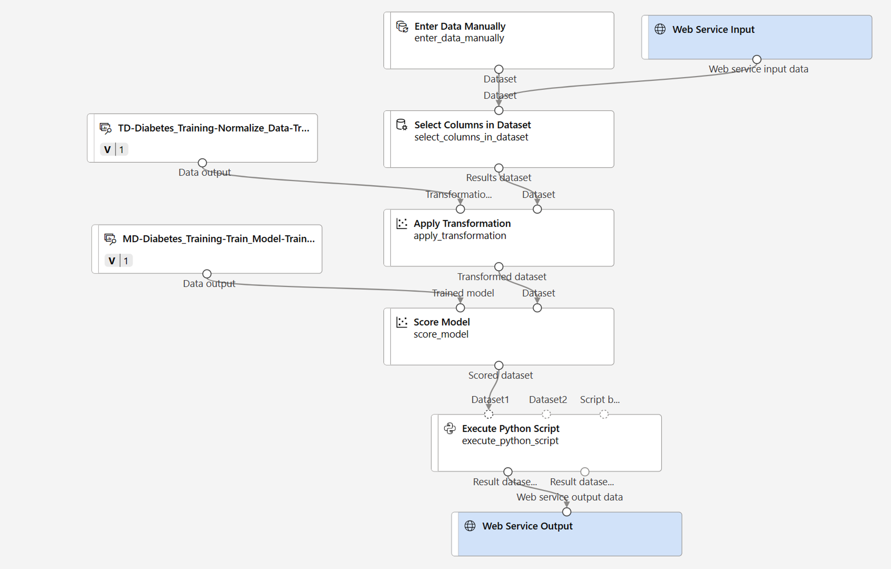

---
lab:
  title: Esplorare la classificazione con la finestra di progettazione di Azure Machine Learning
---

# Esplorare la classificazione con la finestra di progettazione di Azure Machine Learning

> **Nota:** per completare questo lab è necessaria una [sottoscrizione di Azure](https://azure.microsoft.com/free?azure-portal=true) in cui si ha accesso amministrativo.

## Creare un'area di lavoro di Azure Machine Learning  

1. Accedere al [portale di Azure](https://portal.azure.com?azure-portal=true) usando le proprie credenziali Microsoft.

1. Selezionare **+ Crea una risorsa**, cercare *Machine Learning* e creare una nuova risorsa **Azure Machine Learning** con un piano di *Azure Machine Learning*. Usare le seguenti impostazioni:
    - **Sottoscrizione**: *la sottoscrizione di Azure usata*.
    - **Gruppo di risorse**: *creare o selezionare un gruppo di risorse*.
    - **Nome area di lavoro**: *immettere un nome univoco per l'area di lavoro*.
    - **Area**: *selezionare l'area geografica più vicina*.
    - **Account di archiviazione**: *prendere nota del nuovo account di archiviazione predefinito che verrà creato per l'area di lavoro*.
    - **Insieme di credenziali delle chiavi**: *prendere nota del nuovo insieme di credenziali delle chiavi predefinito che verrà creato per l'area di lavoro*.
    - **Application Insights**: *prendere nota della nuova risorsa Application Insights predefinita che verrà creata per l'area di lavoro*.
    - **Registro contenitori**: nessuno (*ne verrà creato uno automaticamente la prima volta che si distribuisce un modello in un contenitore*)

1. Selezionare **Rivedi e crea** e quindi **Crea**. Attendere che l'area di lavoro venga creata (l'operazione può richiedere alcuni minuti) e quindi passare alla risorsa distribuita.

1. Selezionare **Avvia studio** (in alternativa, aprire una nuova scheda nel browser e passare a [https://ml.azure.com](https://ml.azure.com?azure-portal=true)) e accedere allo studio di Azure Machine Learning usando il proprio account Microsoft.

1. Nello studio di Azure Machine Learning verrà visualizzata l'area di lavoro appena creata. In caso contrario, selezionare la directory di Azure nel menu a sinistra. Dal nuovo menu a sinistra selezionare quindi **Aree di lavoro**, dove vengono elencate tutte le aree di lavoro associate alla directory, quindi selezionare quella creata per questo esercizio.

> **Nota:** questo modulo è uno dei molti che usano un'area di lavoro di Azure Machine Learning, inclusi gli altri moduli nel percorso di apprendimento [Concetti fondamentali su Azure per intelligenza artificiale: esplorare gli strumenti visivi per il Machine Learning](https://docs.microsoft.com/learn/paths/create-no-code-predictive-models-azure-machine-learning/). Se si usa la propria sottoscrizione di Azure, è consigliabile creare l'area di lavoro una sola volta e usarla di nuovo negli altri moduli. Alla sottoscrizione di Azure verrà addebitato un importo ridotto per l'archiviazione dei dati, fintanto che l'area di lavoro di Azure Machine Learning è presente nella sottoscrizione. È quindi consigliabile eliminare l'area di lavoro di Azure Machine Learning quando non è più necessaria.

## Creare l'ambiente di calcolo

1. Nello [studio di Azure Machine Learning](https://ml.azure.com?azure-portal=true) selezionare l'icona **&#8801;** (un'icona del menu con tre righe una sopra l'altra) in alto a sinistra per visualizzare le diverse pagine dell'interfaccia. Potrebbe essere necessario ingrandire le dimensioni della schermata. Queste pagine situate nel riquadro a sinistra consentono di gestire le risorse nell'area di lavoro. Selezionare la pagina **Calcolo** (in **Gestisci**).

1. Nella pagina **Calcolo** selezionare la scheda **Cluster di elaborazione** e aggiungere un nuovo cluster di elaborazione con le impostazioni specificate di seguito. Il cluster sarà usato per eseguire il training di un modello di Machine Learning:
    - **Posizione**: *selezionare la stessa posizione dell'area di lavoro. Se la posizione non è nell'elenco, scegliere quella più vicina alla propria posizione*.
    - **Livello macchina virtuale**: Dedicato
    - **Tipo di macchina virtuale**: CPU
    - **Dimensioni macchina virtuale**:
        - Scegliere **Selezionare da tutte le opzioni**
        - Cercare e selezionare **Standard_DS11_v2**
    - Selezionare **Avanti**.
    - **Nome dell'ambiente di calcolo**: *immettere un nome univoco*.
    - **Numero minimo di nodi**: 0
    - **Numero massimo di nodi**: 2
    - **Secondi di inattività prima della riduzione delle prestazioni**: 120
    - **Abilita accesso SSH**: deselezionare l'opzione
    - Selezionare **Crea**.

> **Nota:** le istanze di ambiente di calcolo e i cluster di elaborazione sono basati su immagini di macchine virtuali di Azure standard. Per questo modulo, è consigliabile usare l'immagine *Standard_DS11_v2* per ottenere un equilibrio ottimale tra costi e prestazioni. Se la quota della sottoscrizione in uso non include questa immagine, scegliere un'immagine alternativa, ma tenere presente che un'immagine più grande può generare costi più elevati e un'immagine più piccola potrebbe non essere sufficiente per completare le attività. In alternativa, chiedere all'amministratore di Azure di estendere la quota.

La creazione del cluster di elaborazione potrebbe richiedere diversi minuti. Mentre il processo di creazione è in corso, è possibile procedere con il passaggio successivo.


## Creare un set di dati

1. Nello [studio di Azure Machine Learning](https://ml.azure.com?azure-portal=true) espandere il riquadro a sinistra selezionando l'icona del menu in alto a sinistra nella schermata. Selezionare la pagina **Dati** (in **Asset**). La pagina Dati contiene tabelle o file di dati specifici che si prevede di usare in Azure ML. Da questa pagina è anche possibile creare set di dati.

1. Nella pagina **Dati**, nella scheda **Asset di dati** selezionare **+ Crea**. Configurare quindi un asset dati con le impostazioni seguenti:
    - **Tipo di dati**:
        - **Nome**: diabetes-data
        - **Descrizione**: dati sul diabete
        - **Tipo di set di dati**: tabulare
    - **Origine dati**: da file Web
    - **URL Web**:
        - **URL Web**: https://aka.ms/diabetes-data
        - **Ignora convalida dei dati**: *non selezionare*
    - **Impostazioni**:
        - **Formato di file**: delimitato
        - **Delimitatore**: virgola
        - **Codifica**: UTF-8
        - **Intestazioni colonna**: solo il primo file ha intestazioni
        - **Ignora righe**: nessuna
        - **Il set di dati contiene dati su più righe**: *non selezionare*
    - **Schema**:
        - Includi tutte le colonne diverse da **Path**
        - Rivedi i tipi rilevati automaticamente
    - **Rivedi**
        - Selezionare **Crea**.

1. Dopo aver creato il set di dati, aprirlo e visualizzare la pagina **Esplora** per visualizzare un esempio dei dati. Questi dati rappresentano i dettagli dei pazienti a cui è stato misurato il diabete.

## Creare una pipeline nella finestra di progettazione e caricare un set di dati nel canvas

Per iniziare a usare la finestra di progettazione di Azure Machine Learning, è prima di tutto necessario creare una pipeline e aggiungere il set di dati che si vuole usare.

1. Nello [studio di Azure Machine Learning](https://ml.azure.com?azure-portal=true), nel riquadro a sinistra selezionare la pagina **Finestra di progettazione** (in **Creazione**), quindi selezionare **+** per creare una nuova pipeline.

1. Modificare il nome della bozza da **Pipeline-Created-on-*date*** a **Diabetes Training** (Training sul diabete).

1. Nel progetto, accanto al nome della pipeline a sinistra selezionare quindi l'icona con le frecce per espandere il pannello, se non è già espanso. Il pannello si dovrebbe aprire per impostazione predefinita sul riquadro **Libreria**, indicato dall'icona dei libri nella parte superiore del pannello. Si noti che è presente una barra di ricerca per individuare gli asset. Sono presenti due pulsanti, **Dati** e **Componente**.

    

1. Seleziona **Dati**. Cercare il set di dati **diabetes-data** e posizionarlo sul canvas.

1. Fare clic con il pulsante destro del mouse (CTRL+clic su un Mac) sul set di dati **diabetes-data** nel canvas e selezionare **Anteprima dati**.

1. Esaminare lo schema dei dati nella scheda *Profilo* tenendo presente che è possibile visualizzare le distribuzioni delle varie colonne sotto forma di istogrammi.

1. Scorrere verso il basso e selezionare l'intestazione della colonna **Diabetic**, in cui sono contenuti due valori: **0** e **1**. Questi valori rappresentano le due classi possibili per l'*etichetta* che verrà stimata dal modello, in base alle quali un valore pari a **0** significa che il paziente non ha il diabete e un valore pari a **1** significa che il paziente è diabetico.

1. Scorrere verso l'alto e analizzare le altre colonne, che rappresentano le *caratteristiche* che verranno usate per stimare l'etichetta. Osservare come la maggior parte di queste colonne sia numerica, ma per ogni funzionalità venga usata una scala diversa. I valori **Age** (Età), ad esempio, sono compresi tra 21 e 77, mentre i valori **DiabetesPedigree** sono compresi tra 0,078 e 2,3016. Quando si esegue il training di un modello di Machine Learning, è possibile talvolta che i valori più grandi dominino la funzione predittiva risultante, riducendo l'influenza delle funzionalità su una scala inferiore. In genere gli scienziati dei dati attenuano questa possibile distorsione eseguendo una *normalizzazione* delle colonne con valori numerici in modo che siano in scale simili.

1. Chiudere la scheda **DataOutput** in modo che sia possibile visualizzare il set di dati nel canvas come segue:

    

## Aggiungi trasformazioni

Prima di poter eseguire il training di un modello, è necessario in genere applicare alcune trasformazioni di pre-elaborazione ai dati.

1. Nel riquadro **Libreria** a sinistra selezionare **Componente** per accedere a un'area in cui è inclusa un'ampia gamma di moduli che è possibile usare per la trasformazione dei dati e il training del modello. È anche possibile usare la barra di ricerca per individuare rapidamente i moduli.

    

1. Trovare il modulo **Selezionare le colonne nel set di dati** e posizionarlo nel canvas sotto il set di dati **diabetes-data**. Collegare quindi l'output dalla parte inferiore del set di dati **diabetes-data** all'input nella parte superiore del modulo **Selezionare le colonne nel set di dati**.

1. Fare doppio clic sul modulo **Selezionare le colonne nel set di dati** per accedere a un riquadro delle impostazioni a destra. Selezionare **Modifica colonna**. Nella finestra **Seleziona colonne** selezionare **Per nome** e **Aggiungi tutto** per aggiungere tutte le colonne. Quindi rimuovere **PatientID** e fare clic su **Salva**.

1. Trovare il modulo **Selezionare le colonne nel set di dati** e posizionarlo nel canvas sotto il modulo **Normalizza dati**. Collegare quindi l'output dalla parte inferiore del modulo **Selezionare le colonne nel set di dati** all'input nella parte superiore del modulo **Normalizza dati**, come illustrato di seguito:

    

1. Fare doppio clic sul modulo **Normalizza dati** per visualizzarne le impostazioni: si noti che è necessario specificare il metodo di trasformazione e le colonne da trasformare.

1. Impostare il *metodo di trasformazione* su **MinMax** e *Usa 0 per le colonne costanti se selezionata* su **True**. Modificare le colonne da trasformare con **Modifica colonne**. Selezionare le colonne **Con regole** e copiare e incollare l'elenco seguente in Include column names (Includi nomi colonne):  

```
Pregnancies, PlasmaGlucose, DiastolicBloodPressure, TricepsThickness, SerumInsulin, BMI, DiabetesPedigree, Age
```


Fare clic su **Salva** e chiudere la casella di selezione.

La trasformazione dei dati normalizza le colonne numeriche in modo da metterle sulla stessa scala, evitando così che le colonne con i valori più grandi possano dominare il training del modello. In genere, si applica un intero insieme di trasformazioni di pre-elaborazione come questo per preparare i dati per il training, ma in questo esercizio opteremo per una procedura semplificata.

## Eseguire la pipeline

Per applicare le trasformazioni dei dati, è necessario eseguire la pipeline come esperimento.

1. Selezionare **Configura e invia** nella parte superiore della pagina per aprire la finestra di dialogo **Set up pipeline job** (Configura processo pipeline).

1. Nella pagina **Generale** selezionare **Crea nuovo** e impostare il nome dell'esperimento su **mslearn-diabetes-training** e quindi selezionare **Avanti**.

1. Nella pagina **Input e output** selezionare **Avanti** senza apportare modifiche.

1. Nella pagina **Impostazioni di runtime** viene visualizzato un errore perché non si dispone di un calcolo predefinito per l'esecuzione della pipeline. Nel menu a discesa **Select compute type** (Seleziona il tipo di elaborazione) selezionare *Cluster di elaborazione* e nel menu a discesa **Select Azure ML compute cluster** (Seleziona il cluster di elaborazione Azure ML) selezionare il cluster di elaborazione creato di recente.

1. Selezionare **Rivedi e invia** per esaminare il processo della pipeline e quindi selezionare **Invia** per eseguire la pipeline di training.

1. Attendere qualche minuto per il completamento dell'esecuzione. È possibile controllare lo stato del processo selezionando **Processi** in **Asset**. Selezionare l'esperimento **mslearn-diabetes-training**, quindi selezionare il processo **Diabetes Training** (Training sul diabete).

## Visualizzare i dati trasformati

Al termine dell'esecuzione, il set di dati viene preparato per il training del modello.

1. Fare clic con il pulsante destro del mouse (CTRL+clic su un Mac) sul modulo **Normalizza dati** nel canvas e selezionare **Anteprima dati**. Selezionare **Set di dati trasformato**.

1. Visualizzare i dati, osservando come le colonne numeriche selezionate siano state normalizzate in una scala comune.

1. Chiudere la visualizzazione dei risultati relativi ai dati normalizzati. Tornare alla scheda precedente.

Dopo aver preparato i dati tramite le trasformazioni di dati, è possibile usarli per eseguire il training di un modello di Machine Learning.

## Aggiungere moduli di training

È consigliabile usare un sottoinsieme di dati per eseguire il training del modello e conservare alcuni dati per eseguire il test del modello con training. In questo modo, infatti, è possibile confrontare le etichette stimate dal modello con le etichette effettivamente presenti nel set di dati originale.

In questo esercizio si eseguiranno i passaggi per estendere la pipeline **Diabetes Training** (Training sul diabete), come illustrato di seguito:


Attenersi alla procedura seguente usando l'immagine riportata sopra come riferimento per l'aggiunta e la configurazione dei moduli richiesti.

1. Tornare alla pagina **Finestra di progettazione** e selezionare la pipeline **Diabetes Training** (Training sul diabete).

1. Nel riquadro **Libreria** a sinistra in **Componente** cercare un modulo **Split Data** (Suddividi dati) e posizionarlo sul canvas, sotto il modulo **Normalizza dati**. Collegare quindi l'output (a sinistra) *Transformed Dataset* (Set di dati trasformato) del modulo **Normalizza dati** all'input del modulo **Split Data** (Suddividi dati).

    >**Suggerimento:** usare la barra di ricerca per individuare rapidamente i moduli.

1. Selezionare quindi il modulo **Split data** e configurarne le impostazioni come segue:
    - **Splitting mode** (Modalità di suddivisione): Split Rows (Suddividi righe)
    - **Fraction of rows in the first output dataset** (Frazione di righe nel primo set di dati di output): 0,7
    - **Randomized split** (Suddivisione casuale): True
    - **Random seed** (Valore di inizializzazione casuale): 123
    - **Stratified split** (Suddivisione stratificata): False

1. In **Libreria** cercare un modulo **Train Model** (Training del modello) e posizionarlo sul canvas, sotto il modulo **Split Data** (Suddividi dati). Collegare quindi l'output (a sinistra) *Results dataset1* (Risultati del primo set di dati) del modulo **Split Data** (Suddividi dati) all'input (a destra) *Dataset* del modulo **Train Model** (Training del modello).

1. Il modello di cui si sta eseguendo il training prevede il valore **Diabetic**. Selezionare quindi il modulo **Train Model** e modificarne le impostazioni in modo da impostare la **colonna etichetta** su **Diabetic**.

    L'etichetta **Diabetic** che verrà stimata dal modello è una classe (0 o 1) ed è quindi necessario eseguire il training del modello usando un algoritmo di *classificazione*. Essendo due le classi possibili, è necessario un algoritmo di *classificazione binaria*.

1. In **Libreria** cercare un modulo **Two-Class Logistic Regression** e posizionarlo sul canvas, a sinistra del modulo **Split Data** e sopra il modulo **Train Model**. Connetterne quindi l'output all'input (a sinistra) del *modello non sottoposto a training* del modulo **Train Model**.

   Il test del modello con training si esegue usando il modello per assegnare un *punteggio* al set di dati di convalida separato durante la divisione dei dati originali. In altri termini, si stimano le etichette relative alle funzionalità nel set di dati di convalida.

1. In **Libreria** cercare un modulo **Score Model** e posizionarlo sul canvas, sotto il modulo **Train Model**. Collegare quindi l'output del modulo **Train Model** (Training del modello) all'input (a sinistra) *Trained model* (Training del modello) del modulo **Score Model** (Punteggio del modello) e collegare l'output (a destra) *Results dataset2* (Risultati del secondo set di dati) del modulo **Split data** (Suddividi dati) all'input (a destra) *Set di dati* del modulo **Score Model** (Punteggio del modello).

## Eseguire la pipeline di training

A questo punto è possibile eseguire la pipeline di training e il training del modello.

1. Selezionare **Configure & Submit** (Configura e invia) ed eseguire la pipeline usando l'esperimento esistente denominato **mslearn-diabetes-training**.

1. Attendere il completamento del processo di esecuzione dell'esperimento. Il processo può richiedere 5 o più minuti.

1. È possibile controllare lo stato del processo selezionando **Processi** in **Asset**. Selezionare l'esperimento **mslearn-diabetes-training**, quindi selezionare l'ultimo processo **Diabetes Training** (Training sul diabete).

1. Nella nuova scheda fare clic con il pulsante destro del mouse (CTRL+clic su un Mac) sul modulo **Score Model** (Punteggio del modello) nel canvas, selezionare **Anteprima dati** e quindi **Set di dati con punteggio** per visualizzare i risultati.

1. Scorrere verso destra e osservare che accanto alla colonna **Diabetic** (Diabetico), contenente i valori effettivi dell'etichetta, è presente una nuova colonna denominata **Scored Labels** (Etichette con punteggio), contenente i valori delle etichette stimate, e una colonna **Scored Probabilities** (Probabilità con punteggio), contenente un valore di probabilità compreso tra 0 e 1. Ciò indica la probabilità di una previsione *positiva*, quindi le probabilità maggiori di 0,5 generano un'etichetta equivalente a ***1*** (diabetico), mentre quelle tra 0 e 0,5 generano un'etichetta equivalente a ***0*** (non diabetico).

1. Chiudere la scheda **Scored_dataset**.

Il modello stima i valori per l'etichetta **Diabetic** (Diabetico), ma quanto sono affidabili queste stime? Per capirlo, è necessario valutare il modello.

I dati di convalida tenuti da parte e usati per assegnare un punteggio al modello includono i valori noti relativi all'etichetta. Per convalidare il modello, è possibile confrontare i valori reali con i valori stimati dell'etichetta durante l'assegnazione del punteggio al set di dati di convalida. In base al confronto, è possibile quindi calcolare varie metriche con cui valutare le prestazioni del modello.

## Aggiungere un modulo Evaluate Model

1. Tornare a **Finestra di progettazione** e aprire la pipeline **Diabetes Training** (Training sul diabete) creata.

1. In **Libreria** cercare un modulo **Evaluate Model** (Valuta modello) e posizionarlo sul canvas, sotto il modulo **Score Model** (Punteggio del modello). Collegare l'output del modulo **Score Model** (Punteggio del modello) all'input (a sinistra) *Set di dati con punteggio* del modulo **Evaluate Model** (Valuta modello).

1. Verificare che la pipeline sia simile alla seguente:

    

1. Selezionare **Configure & Submit** (Configura e invia) ed eseguire la pipeline usando l'esperimento esistente denominato **mslearn-diabetes-training**.

1. Attendere il completamento del processo di esecuzione dell'esperimento.

1. È possibile controllare lo stato del processo selezionando **Processi** in **Asset**. Selezionare l'esperimento **mslearn-diabetes-training**, quindi selezionare l'ultimo processo **Diabetes Training** (Training sul diabete).

1. Nella nuova scheda fare clic con il pulsante destro del mouse (CTRL+clic su un Mac) sul modulo **Evaluate Model** (Valuta modello) nel canvas, selezionare **Anteprima dati** e quindi **Risultati valutazione** per visualizzare le metriche delle prestazioni. Queste metriche consentono ai data scientist di valutare le prestazioni del modello di stima in base ai dati di convalida.

1. Scorrere verso il basso per visualizzare la *matrice di confusione* per il modello. Osservare i conteggi dei valori stimati ed effettivi per ogni classe possibile. 

1. Esaminare le metriche a sinistra della matrice di confusione, che includono:
    - **Accuratezza**: in altre parole, in quale proporzione il modello ha correttamente stimato i casi di diabete?
    - **Precisione**: in altre parole, su tutti i pazienti che *il modello ha stimato* come affetti da diabete, la percentuale di volte in cui il modello è corretto. 
    - **Richiamo**: in altre parole, di tutti i pazienti *che hanno effettivamente* il diabete, quanti casi di diabete il modello ha identificato correttamente?
    - **Punteggio F1**

1. Usare il dispositivo di scorrimento **Soglia** disponibile sopra l'elenco delle metriche. Provare a spostare il dispositivo di scorrimento Soglia e osservare l'effetto sulla matrice di confusione. Spostandolo fino all'estrema sinistra (0), la metrica di richiamo diventa 1, mentre spostandolo verso destra (1), la metrica di richiamo diventa 0.

1. Osservare sopra il dispositivo di scorrimento Soglia la **curva ROC** e la metrica **AUC** (area sotto la curva) elencata con le altre metriche sottostanti. Per avere un'idea del modo in cui quest'area rappresenta le prestazioni del modello, si supponga di avere una diagonale diritta dall'angolo inferiore sinistro all'angolo superiore destro del grafico ROC. Questa linea rappresenterebbe le prestazioni previste se si tirasse una moneta per ogni paziente. In questo caso, si indovinerebbe circa la metà dei casi e l'area sotto la linea diagonale rappresenterebbe un punteggio AUC di 0,5. Se il punteggio AUC relativo al modello è superiore a quello di un modello di classificazione binaria, significa che il modello garantisce prestazioni migliori rispetto a un'ipotesi casuale.

1. Chiudere la scheda **Evaluation_results**.

Le prestazioni di questo modello non sono molto elevate, soprattutto perché è stata eseguita solo una parte delle funzionalità di progettazione e di pre-elaborazione. È possibile provare un algoritmo di classificazione diverso, ad esempio **Two-Class Decision Forest** e confrontare i risultati. È possibile collegare gli output del modulo **Split Data** (Suddividi dati) a più moduli **Train Model** (Training del modello) e **Score Model** (Punteggio del modello) e connettere un secondo modulo **Score Model** (Punteggio del modello) al modulo **Evaluate Model** (Valuta modello) per visualizzare un confronto affiancato. L'obiettivo dell'esercizio è semplicemente illustrare la classificazione e l'interfaccia della finestra di progettazione di Azure Machine Learning e non eseguire il training di un modello perfetto.

## Creare una pipeline di inferenza

1. Individuare il menu sopra il canvas e selezionare **Crea pipeline di inferenza**. Potrebbe essere necessario espandere la schermata a schermo intero e fare clic sull'icona con i tre puntini **...** nell'angolo in alto a destra della schermata per trovare **Crea pipeline di inferenza** nel menu.  

    

1. Nell'elenco a discesa **Crea pipeline di inferenza** selezionare **Real-time inference pipeline** (Pipeline di inferenza in tempo reale). Dopo alcuni secondi, verrà aperta una nuova pipeline denominata **Diabetes Training-real time inference** (Training sul diabete, inferenza in tempo reale).

1. Assegnare alla nuova pipeline il nome **Predict Diabetes** e riesaminarla. Alcune trasformazioni e passaggi di training fanno parte di questa pipeline. Il modello sottoposto a training verrà usato per assegnare un punteggio ai nuovi dati. La pipeline contiene anche un output del servizio Web che restituisce i risultati.

    Alla pipeline di inferenza dovranno essere apportate le seguenti modifiche:

    

    - Aggiungere un componente **Web Service Input** per inviare i nuovi dati.
    - Sostituire il set di dati **diabetes-data** con un modulo **Immetti dati manualmente** in cui non sia inclusa la colonna di etichetta (**Diabetic**).
    - Modificare le colonne selezionate nel modulo **Selezionare le colonne nel set di dati**.
    - Rimozione del modulo **Evaluate Model** (Valuta modello).
    - Inclusione di un modulo **Execute Python Script** (Esegui script Python) prima dell'output del servizio Web modo che vengano restituiti solo l'ID paziente, il valore dell'etichetta stimato e la probabilità.

1. La pipeline non include automaticamente un componente **Web Service Input** (Input del servizio Web) per i modelli creati dai set di dati personalizzati. Cercare un componente **Web Service Input** (Input del servizio Web) nella libreria e posizionarlo nella parte superiore della pipeline. Collegare l'output del componente **Web Service Input** (Input del servizio Web) al componente **Selezionare le colonne nel set di dati** già presente nel canvas.

1. La pipeline di inferenza presuppone che i nuovi dati corrispondano allo schema dei dati di training originali e, pertanto, conterrà il set di dati **diabetes-data** della pipeline di training. I dati di input, tuttavia, includono l'etichetta **Diabetic** (Diabetico) stimata dal modello, che non è inclusa nei dati di nuovi pazienti per i quali non è stata ancora eseguita una previsione sul diabete. Eliminare questo modulo e sostituirlo con un modulo **Immetti dati manualmente** contenente i dati in formato CSV riportati di seguito, in cui sono inclusi valori di caratteristiche senza etichette per tre nuove osservazioni di pazienti:

    ```CSV
    PatientID,Pregnancies,PlasmaGlucose,DiastolicBloodPressure,TricepsThickness,SerumInsulin,BMI,DiabetesPedigree,Age
    1882185,9,104,51,7,24,27.36983156,1.350472047,43
    1662484,6,73,61,35,24,18.74367404,1.074147566,75
    1228510,4,115,50,29,243,34.69215364,0.741159926,59
    ```

1. Collegare il nuovo modulo **Immetti dati manualmente** allo stesso input del **set di dati** del modulo **Selezionare le colonne nel set di dati** come **input del servizio Web**.

1. Modificare il modulo **Selezionare le colonne nel set di dati**. Rimuovere **Diabetic** (Diabetico) da *Colonne selezionate*.

1. La pipeline di inferenza includerà il modulo **Evaluate Model** (Valuta modello). Poiché tale modulo non è utile per eseguire stime a partire da nuovi dati, è necessario eliminarlo.

1. L'output del modulo **Score Model** (Punteggio del modello) includerà tutte le funzionalità di input, l'etichetta stimata e il punteggio di probabilità. Per limitare l'output solo alla stima e alla probabilità:
    - Eliminare il collegamento tra il modulo **Score Model** (Punteggio del modello) e l'**output del servizio Web**.
    - Aggiungere un modulo **Execute Python Script** (Esegui script Python) sostituendo lo script Python predefinito con il codice seguente, che seleziona solo le colonne **PatientID**, **Scored Labels** (Etichette con punteggio) e **Scored Probabilities** (Probabilità con punteggio) e le rinomina in modo appropriato:

    ```Python
    import pandas as pd
    
    def azureml_main(dataframe1 = None, dataframe2 = None):
    
        scored_results = dataframe1[['Scored Labels', 'Scored Probabilities']]
        scored_results.rename(columns={'Scored Labels':'DiabetesPrediction',
                                    'Scored Probabilities':'Probability'},
                            inplace=True)
        return scored_results
    ```

1. Collegare l'output del modulo **Score Model** (Punteggio del modello) all'input (più a sinistra) *Dataset1* (Primo set di dati) del modulo **Execute Python Script** (Esegui script Python) e l'output (a sinistra) *Result dataset* (Risultato del set di dati) del modulo **Execute Python Script** (Esegui script Python) a **Web Service Output** (Output del servizio Web).

1. Verificare che la pipeline sia simile alla seguente immagine:

    

1. Eseguire la pipeline come nuovo esperimento denominato **mslearn-diabetes-inference** nel cluster di elaborazione. L'esecuzione dell'esperimento può richiedere alcuni minuti.

1. Tornare alla scheda **Processi**. Selezionare l'esperimento **mslearn-diabetes-inference** e quindi selezionare il processo **Predict Diabetes** (Previsione sul diabete).

1. Al termine della pipeline, selezionare il modulo **Execute Python Script** (Esegui script Python). Selezionare **Anteprima dei dati** e quindi **Set di dati dei risultati** per esaminare le etichette stimate e le probabilità relative alle tre osservazioni di pazienti nei dati di input.

La pipeline di inferenza stima se i pazienti sono a rischio di diabete in base alle rispettive caratteristiche. A questo punto si è pronti per pubblicare la pipeline in modo che le applicazioni client possano usarla.

Dopo aver creato e testato una pipeline di inferenza per l'inferenza in tempo reale, è possibile pubblicarla come servizio per poter usare le applicazioni client.

> **Nota:** in questo esercizio si distribuirà il servizio Web in un'istanza di Azure Container (ACI). Questo tipo di risorsa di calcolo viene creato dinamicamente ed è utile per le attività di sviluppo e test. Per un ambiente di produzione, è necessario creare un *cluster di inferenza*, che fornisce un cluster del servizio Azure Kubernetes che offre scalabilità e sicurezza migliori.

## Distribuire un servizio

1. Nella parte superiore della finestra del processo **Predict Diabetes** (Previsione sul diabete) selezionare **Distribuisci**.

    

1. Nella schermata **Set up real-time endpoint** (Configura endpoint in tempo reale) selezionare **Distribuisci un nuovo endpoint in tempo reale** usando le impostazioni seguenti:
    - **Nome**: predict-diabetes
    - **Descrizione**: Classify diabetes
    - **Tipo di elaborazione**: Istanza di Azure Container

1. Selezionare **Distribuisci** e attendere il completamento della distribuzione del servizio Web tenendo presente che potrebbero essere necessari alcuni minuti.

## Eseguire il test del servizio

1. Nella pagina **Endpoint** aprire l'endpoint in tempo reale **predict-diabetes**.

    

1. Quando si apre l'endpoint **predict-diabetes**, selezionare la scheda **Test**, che verrà usata per testare il modello con i nuovi dati. Eliminare i dati correnti in **Dati di input per testare l'endpoint in tempo reale**. Copiare e incollare i dati seguenti nella sezione dei dati:  

    ```JSON
    {
      "Inputs": {
        "input1":
          [
            { "PatientID": 1882185,
              "Pregnancies": 9,
              "PlasmaGlucose": 104,
              "DiastolicBloodPressure": 51,
              "TricepsThickness": 7,
              "SerumInsulin": 24,
              "BMI": 27.36983156,
              "DiabetesPedigree": 1.3504720469999998,
              "Age": 43 }
            ]
          },
      "GlobalParameters":  {}
    }
    ```

    > **Nota:** il codice JSON definisce solo le caratteristiche relative a un paziente e usa il servizio **predict-diabetes** creato per formulare una diagnosi di diabete.

1. Selezionare **Verifica**. Sulla destra della schermata dovrebbe essere visualizzato l'output **DiabetesPrediction**. L'output è 1 se viene stimato che il paziente abbia il diabete e 0 se invece viene stimato che il paziente non soffra di questa malattia.  

    

    È stato appena testato un servizio pronto per essere connesso a un'applicazione client usando le credenziali nella scheda **Utilizza**. Il lab termina qui. È possibile continuare a fare pratica con il servizio appena distribuito.

## Eliminazione

Il servizio Web creato è ospitato in un'*Istanza di contenitore di Azure*. Se non si vogliono eseguire altri esperimenti con tale servizio, è consigliabile eliminare l'endpoint per evitare di accumulare tempi di utilizzo superflui per Azure. È anche necessario eliminare anche il cluster di elaborazione.

1. In [Azure Machine Learning Studio](https://ml.azure.com?azure-portal=true), nella scheda **Endpoint**, selezionare l'endpoint **predict-diabetes**. Selezionare quindi **Elimina** e confermare l'eliminazione dell'endpoint.

1. Nella pagina **Calcolo**, nella scheda **Cluster di elaborazione** selezionare il cluster di elaborazione e quindi **Elimina**.

>**Nota:** l'eliminazione delle risorse di calcolo garantisce che alla sottoscrizione non vengano addebitati i costi di calcolo corrispondenti. Verrà tuttavia addebitato un importo ridotto per l'archiviazione dei dati, fintanto che l'area di lavoro di Azure Machine Learning è presente nella sottoscrizione. Se è stata completata l'esplorazione di Azure Machine Learning, è possibile eliminare l'area di lavoro di Azure Machine Learning e le risorse associate. Tuttavia, se si prevede di completare qualsiasi altro lab in questa serie, sarà necessario ricrearla.
>
> Per eliminare l'area di lavoro:
>
> 1. Nel [portale di Azure](https://portal.azure.com?azure-portal=true), nella pagina **Gruppi di risorse**, aprire il gruppo di risorse specificato durante la creazione dell'area di lavoro di Azure Machine Learning.
> 1. Fare clic su **Elimina gruppo di risorse**, digitare il nome del gruppo di risorse per confermare che si vuole eliminarlo e quindi selezionare **Elimina**.
