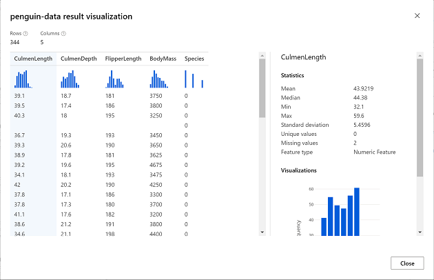
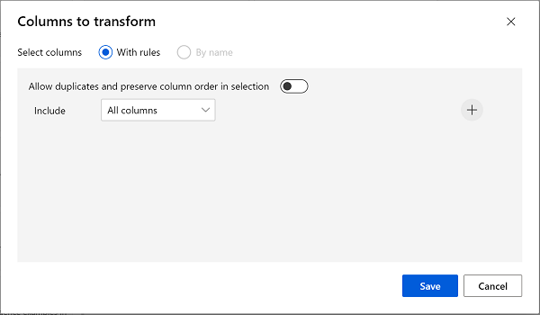

---
lab:
  title: Esplorare il clustering con la finestra di progettazione di Azure Machine Learning
---

# Esplorare il clustering con la finestra di progettazione di Azure Machine Learning

> **Nota** Per completare questo lab, è necessaria una [sottoscrizione di Azure](https://azure.microsoft.com/free?azure-portal=true) in cui si ha accesso amministrativo.

## Creare un'area di lavoro di Machine Learning di Azure  

1. Accedere al [portale di Azure](https://portal.azure.com?azure-portal=true) usando le proprie credenziali Microsoft.

1. Selezionare **+ Crea una risorsa**, cercare *Machine Learning* e creare una nuova risorsa **Azure Machine Learning** con un piano di *Azure Machine Learning*. Usare le seguenti impostazioni:
    - **Sottoscrizione**: *la sottoscrizione di Azure usata*.
    - **Gruppo di risorse**: *creare o selezionare un gruppo di risorse*.
    - **Nome area di lavoro**: *immettere un nome univoco per l'area di lavoro*.
    - **Area**: *selezionare l'area geografica più vicina*.
    - **Account di archiviazione**: *prendere nota del nuovo account di archiviazione predefinito che verrà creato per l'area di lavoro*.
    - **Insieme di credenziali delle chiavi**: *prendere nota del nuovo insieme di credenziali delle chiavi predefinito che verrà creato per l'area di lavoro*.
    - **Application Insights**: *prendere nota della nuova risorsa Application Insights predefinita che verrà creata per l'area di lavoro*.
    - **Registro contenitori**: Nessuno (*ne verrà creato uno automaticamente la prima volta che si distribuisce un modello in un contenitore*)

1. Selezionare **Rivedi e crea** e quindi **Crea**. Attendere che l'area di lavoro venga creata (l'operazione può richiedere alcuni minuti) e quindi passare alla risorsa distribuita.

1. Selezionare **Avvia studio** (in alternativa, aprire una nuova scheda nel browser e passare a [https://ml.azure.com](https://ml.azure.com?azure-portal=true)) e accedere allo studio di Azure Machine Learning usando il proprio account Microsoft.

1. Nello studio di Azure Machine Learning verrà visualizzata l'area di lavoro appena creata. In caso contrario, selezionare la directory di Azure nel menu a sinistra. Quindi, dal nuovo menu a sinistra selezionare **Aree di** lavoro, in cui sono elencate tutte le aree di lavoro associate alla directory e selezionare quella creata per questo esercizio.

> **Nota** Questo modulo è uno dei molti che usano un'area di lavoro di Azure Machine Learning, inclusi gli altri moduli nel percorso di apprendimento [Elementi fondamentali di Microsoft Azure per intelligenza artificiale: Esplorare gli strumenti visivi per Machine Learning](https://docs.microsoft.com/learn/paths/create-no-code-predictive-models-azure-machine-learning/). Se si usa la propria sottoscrizione di Azure, è consigliabile creare l'area di lavoro una sola volta e riutilizzarla negli altri moduli. Alla sottoscrizione di Azure verrà addebitato un importo ridotto per l'archiviazione dei dati, fintanto che l'area di lavoro di Azure Machine Learning è presente nella sottoscrizione. È quindi consigliabile eliminare l'area di lavoro di Azure Machine Learning quando non è più necessaria.

## Creare l'ambiente di calcolo

1. In [studio di Azure Machine Learning](https://ml.azure.com?azure-portal=true) selezionare l'icona **&#8801;** (un'icona di menu simile a uno stack di tre righe) in alto a sinistra per visualizzare le varie pagine nell'interfaccia (potrebbe essere necessario ingrandire le dimensioni dello schermo). Queste pagine situate nel riquadro a sinistra consentono di gestire le risorse nell'area di lavoro. Selezionare la pagina **Calcolo** (in **Gestisci**).

2. Nella pagina **Calcolo** selezionare la scheda **Cluster di elaborazione** e aggiungere un nuovo cluster di elaborazione con le impostazioni specificate di seguito. Il cluster sarà usato per eseguire il training di un modello di Machine Learning.
    - **Località**: *selezionare la stessa località dell'area di lavoro. Se la località non è nell'elenco, scegliere quella più vicina alla propria posizione*.
    - **Livello macchina virtuale**: Dedicato
    - **Tipo di macchina virtuale**: CPU
    - **Dimensioni macchina virtuale**:
        - Scegliere **Selezionare da tutte le opzioni**
        - Cercare e selezionare **Standard_DS11_v2**
    - Selezionare **Avanti**
    - **Nome dell'ambiente di calcolo**: *immettere un nome univoco*.
    - **Numero minimo di nodi**: 0
    - **Numero massimo di nodi**: 2
    - **Secondi di inattività prima della riduzione delle prestazioni**: 120
    - **Abilita accesso SSH**: deselezionare l'opzione
    - Selezionare **Crea**

> **Nota** Le istanze di ambiente di calcolo e i cluster di elaborazione sono basati su immagini di macchine virtuali di Azure standard. Per questo modulo, è consigliabile usare l'immagine *Standard_DS11_v2* per ottenere un equilibrio ottimale tra costi e prestazioni. Se la quota della sottoscrizione in uso non include questa immagine, scegliere un'immagine alternativa, ma tenere presente che un'immagine superiore può generare costi più elevati e un'immagine inferiore potrebbe non essere sufficiente per completare le attività. In alternativa, chiedere all'amministratore di Azure di estendere la quota.

La creazione del cluster di elaborazione potrebbe richiedere diversi minuti. Durante l'attesa, è possibile procedere con il passaggio successivo.

## Creare una pipeline nella finestra di progettazione

Per iniziare a usare la finestra di progettazione di Azure Machine Learning, è innanzitutto necessario creare una pipeline.

1. In [studio di Azure Machine Learning](https://ml.azure.com?azure-portal=true) espandere il riquadro sinistro selezionando l'icona del menu in alto a sinistra della schermata. Visualizzare la pagina della **finestra di progettazione** (in **Autore**) e selezionare il segno più per creare una nuova pipeline.

1. Nella parte superiore destra della schermata, selezionare **Impostazioni**. Se il riquadro **Impostazioni** non è visibile, selezionare l'icona a forma di ingranaggio accanto al nome della pipeline nella parte superiore.

1. In **Impostazioni** è necessario specificare una destinazione di calcolo in cui eseguire la pipeline. In **Seleziona tipo di calcolo**, selezionare **Cluster di elaborazione**. Quindi in **Selezionare cluster di elaborazione di Azure ML** selezionare il cluster di elaborazione creato in precedenza.

1. In **Impostazioni**, in **Dettagli bozza** modificare il nome della bozza (**Pipeline-Created-on-* date***) in **Train Penguin Clustering**.

1. Selezionare l'*icona di chiusura* in alto a destra del riquadro **Impostazioni** per chiudere il riquadro e quindi selezionare **Salva**.

    

## Creare un set di dati

In Azure Machine Learning i dati per il training dei modelli e altre operazioni vengono in genere incapsulati in un oggetto denominato *set di dati*. In questo modulo verrà usato un set di dati che include osservazioni relative a tre specie di pinguini.

1. In [studio di Azure Machine Learning](https://ml.azure.com?azure-portal=true) espandere il riquadro sinistro selezionando l'icona del menu in alto a sinistra della schermata. Visualizzare la pagina **Dati** (in **Asset**). La pagina Dati contiene tabelle o file di dati specifici che si prevede di usare in Azure ML. Da questa pagina è anche possibile creare set di dati.

1. Nella pagina **Dati**, nella scheda **Asset di dati** selezionare **Crea**. Configurare quindi un asset dati con le impostazioni seguenti:
    * **Tipo di dati**:
        * **Nome**: penguin-data
        * **Descrizione**: Penguin data
        * **Dataset type** (Tipo di set di dati): tabulare
    * **Origine dati**: da file Web
    * **Web URL** (URL Web): 
        * **Web URL** (URL Web): https://aka.ms/penguin-data
        * **Ignora convalida dei dati**: *non selezionare*
    * **Impostazioni**:
        * **Formato di file**: delimitato
        * **Delimitatore**: virgola
        * **Codifica**: UTF-8
        * **Intestazioni colonna**: solo il primo file ha intestazioni
        * **Ignora righe**: Nessuno
        * **Il set di dati contiene dati su più righe**: *non selezionare*
    * **Schema**:
        * Includi tutte le colonne diverse da **Path**
        * Rivedi i tipi rilevati automaticamente
    * **Verifica**
        * Selezionare **Crea**

1. Dopo aver creato il set di dati, aprirlo e visualizzare la pagina **Esplora** per visualizzare un esempio dei dati. Questi dati rappresentano le misurazioni relative alla lunghezza e alla profondità del becco, alla lunghezza delle pinne e alla massa del corpo per più osservazioni di pinguini. Nel set di dati sono rappresentate tre specie di pinguini: *Adelie*, *Gentoo* e *Chinstrap*.

> **Nota** Il set di dati dei pinguini usato in questo esercizio è un subset dei dati raccolti e resi disponibili dalla [dottoressa Kristen Gorman](https://www.uaf.edu/cfos/people/faculty/detail/kristen-gorman.php) e dalla [Palmer Station, Antarctica LTER](https://pal.lternet.edu/), membro della [Rete LTER (Long Term Ecological Research Network)](https://lternet.edu/).

### Caricare i dati nel canvas

1. Tornare alla pipeline selezionando **Finestra di progettazione** nel menu a sinistra. Nella pagina **Progettazione** selezionare **Train Penguin Clustering**.

1. Accanto al nome della pipeline a sinistra selezionare l'icona con le frecce per espandere il pannello, se non è già espanso. Il pannello si dovrebbe aprire per impostazione predefinita sul riquadro **Libreria**, indicato dall'icona dei libri nella parte superiore del pannello. Si noti che è presente una barra di ricerca per individuare gli asset. Sono presenti due pulsanti, **Dati** e **Componente**.

    

1. Fare clic su **Dati**. Cercare il set di dati **penguin-data** e posizionarlo nel canvas.

1. Fare clic con il pulsante destro del mouse (CTRL+clic su un Mac) sul set di dati **penguin-data** nel canvas e fare clic su **Anteprima dei dati**.

1. Esaminare lo schema *Profile* dei dati tenendo presente che è possibile visualizzare le distribuzioni delle varie colonne sotto forma di istogrammi. Selezionare quindi la colonna **CulmenLength**. Il set di dati dovrebbe essere simile al seguente:

    

1. Di seguito sono descritte le caratteristiche del set di dati.

    - Il set di dati include le colonne seguenti:
        - **CulmenLength**: lunghezza del becco del pinguino in millimetri.
        - **CulmenDepth**: profondità del becco del pinguino in millimetri.
        - **FlipperLength**: lunghezza della pinna del pinguino in millimetri.
        - **BodyMass**: peso del pinguino in grammi.
        - **Species**: indicatore della specie (0:"Adelie", 1:"Gentoo", 2:"Chinstrap")
    - Nella colonna **CulmenLength** sono presenti due valori mancanti (le colonne **CulmenDepth**, **FlipperLength**e **BodyMass** hanno anche due valori mancanti).
    - I valori di misurazione sono espressi in scale diverse (da decine di millimetri a migliaia di grammi).

1. Chiudere la visualizzazione del set di dati in modo che sia possibile visualizzare il set di dati nell'area di disegno della pipeline.

## Applicare trasformazioni

1. Nel riquadro **Libreria** a sinistra fare clic su **Componente** per accedere a un'area in cui è inclusa un'ampia gamma di moduli che è possibile usare per la trasformazione dei dati e il training del modello. È anche possibile usare la barra di ricerca per individuare rapidamente i moduli.

    

1. Per eseguire il clustering delle osservazioni di pinguini verranno usate solo le misurazioni. La colonna delle specie verrà ignorata. Cercare quindi il modulo **Seleziona colonne in set di dati** e posizionarlo nel canvas, sotto il modulo **penguin-data** e collegare l'output nella parte inferiore del modulo **penguin-data** all'input nella parte superiore del modulo **Seleziona colonne in set di dati**, come illustrato di seguito:

    

1. Fare doppio clic sul modulo **Seleziona colonne in set di dati** e nel riquadro a destra selezionare **Modifica colonna**. Nella finestra **Seleziona colonne** selezionare **Per nome** e usare i collegamenti **+** per selezionare i nomi di colonna **CulmenLength**, **CulmenDepth**, **FlipperLength** e **BodyMass**, come illustrato di seguito:

    

1. Chiudere le impostazioni del modulo **Seleziona colonne in set di dati** per tornare al canvas della finestra di progettazione.

1. In **Libreria** cercare un modulo **Pulisci dati mancanti** e posizionarlo nel canvas sotto il modulo **Seleziona colonne in set di dati** e collegarli come illustrato di seguito:

    

1. Fare doppio clic sul modulo **Pulisci dati mancanti** e nel riquadro delle impostazioni disponibile a destra fare clic su **Modifica colonna**. Nella finestra **Colonne da pulire** selezionare **Con regole** e includere **Tutte le colonne**, come illustrato di seguito:

    

1. Mantenere il modulo **Clean Missing Data** selezionato e nel riquadro delle impostazioni specificare i seguenti valori di configurazione:
    - **Minimum missing value ratio** (Rapporto minimo valori mancanti): 0.0
    - **Maximum missing value ratio** (Rapporto massimo valori mancanti): 1,0
    - **Cleaning mode** (Modalità di pulizia): Remove entire row (Rimuovi intera riga)

1. In **Libreria** cercare un modulo **Normalizza dati** e posizionarlo nel canvas, sotto il modulo **Pulisci dati mancanti**. Collegare quindi l'output più a sinistra del modulo **Clean Missing Data** all'input del modulo **Normalize Data**.

    

1. Fare doppio clic sul modulo **Normalizza dati** e nel riquadro a destra impostare **Metodo di trasformazione** su **MinMax** e selezionare **Modifica colonna**. Nella finestra **Colonne da trasformare** selezionare **Con regole** e includere **Tutte le colonne**, come illustrato di seguito:

    

1. Chiudere le impostazioni del modulo **Normalizza dati** per tornare al canvas della finestra di progettazione.

## Eseguire la pipeline

Per applicare le trasformazioni dei dati, è necessario eseguire la pipeline come esperimento.

1. Selezionare **Invia** ed eseguire la pipeline come un **nuovo esperimento** denominato **mslearn-penguin-training** nel cluster di elaborazione.

1. Attendere che venga completata. Il processo può richiedere 5 o più minuti.

    

    Si noti che il pannello a sinistra si trova ora nel riquadro **Processi inviati**. Quando l'esecuzione sarà completata, il processo assumerà lo stato **Completato**.

## Visualizzare i dati trasformati

1. Al termine dell'esecuzione il set di dati è pronto per il training del modello. Fare clic su **Dettagli processo**. Verrà visualizzata un'altra scheda che mostrerà i moduli in questo modo:

    

1. Nella nuova scheda fare clic con il pulsante destro del mouse sul modulo **Normalizza dati**, selezionare **Anteprima dei dati** e quindi **Set di dati trasformato** per visualizzare i risultati.

1. Visualizzare i dati. Si potrà notare che la colonna **Species** è stata rimossa, non sono presenti valori mancanti e i valori per tutte e quattro le funzionalità sono stati normalizzati in base a una scala comune.

1. Chiudere la visualizzazione dei risultati relativi ai dati normalizzati. Tornare alla scheda della pipeline precedente.

Ora che sono state selezionate e preparate le caratteristiche del set di dati desiderate, è possibile usarle per eseguire il training di un modello di clustering.

Dopo aver preparato i dati tramite le trasformazioni di dati, è possibile usarli per eseguire il training di un modello di Machine Learning.

## Aggiungere moduli di training

Eseguire i passaggi seguenti per estendere la pipeline **Train Penguin Clustering**, come illustrato qui:


Attenersi alla procedura seguente usando l'immagine riportata sopra come riferimento per l'aggiunta e la configurazione dei moduli richiesti.

1. Aprire la pipeline **Train Penguin Clustering**, se non è già aperta.

1. Nel riquadro **Libreria** a sinistra cercare un modulo **Split Data** e posizionarlo sul canvas, sotto il modulo **Normalize Data**. Collegare quindi l'output (a sinistra) del modulo **Normalize Data** all'input del modulo **Split Data**.

    >**Suggerimento** Usare la barra di ricerca per individuare rapidamente i moduli. 

1. Selezionare il modulo **Split Data** e configurarne le impostazioni nel modo seguente:
    * **Splitting mode** (Modalità di suddivisione): Split Rows (Dividi righe)
    * **Fraction of rows in the first output dataset** (Frazione di righe nel primo set di dati di output): 0,7
    * **Randomized split**: True
    * **Random seed** (Valore di inizializzazione casuale): 123
    * **Stratified split** (Divisione stratificata): Falso

1. Nella **libreria di asset** cercare un modulo **Train Clustering Model** e posizionarlo sul canvas, sotto il modulo **Split Data**. Collegare quindi l'output *Results dataset1* (a sinistra) del modulo **Split Data** all'input *Dataset* (a destra) del modulo **Train Clustering Model**.

1. Il modello di clustering dovrebbe assegnare cluster agli elementi di dati usando tutte le caratteristiche selezionate dal set di dati originale. Fare doppio clic sul modulo **Training Clustering Model** e selezionare **Modifica colonna** nel riquadro a destra. Usare l'opzione **With rules** (Con regole) per selezionare tutte le colonne, ad esempio:

    

1. Il modello di cui si esegue il training userà le caratteristiche per raggruppare i dati in cluster ed è quindi necessario eseguire il training del modello usando un algoritmo di *clustering*. Nella **libreria di asset** cercare un modulo **K-Means Clustering** e posizionarlo sul canvas, a sinistra del set di dati **penguin-data** e sopra il modulo **Train Clustering Model**. Collegarne quindi l'output all'input **Untrained model** del modulo **Train Clustering Model**.

1. L'algoritmo *K-Means* raggruppa gli elementi nel numero di cluster specificato, ovvero un valore indicato come ***K***. Selezionare il modulo **K-Means Clustering** e nel riquadro a destra impostare il parametro **Number of centroids** su **3**.

    > **Nota** È possibile considerare le osservazioni di dati, come le misurazioni dei pinguini, come vettori multidimensionali. L'algoritmo K-Means funziona eseguendo le operazioni seguenti:
    > 1. Inizializza le coordinate di *K* come punti selezionati casualmente, denominati *centroidi*, nello spazio *n*-dimensionale (dove *n* è il numero di dimensioni nei vettori delle caratteristiche).
    > 2. Traccia i vettori delle caratteristiche come punti nello stesso spazio e assegna ogni punto al centroide più vicino.
    > 3. Sposta i centroidi al centro dei punti allocati (in base alla distanza *media*).
    > 4. Riassegna i punti al centroide più vicino dopo lo spostamento.
    > 5. Ripete i passaggi 3 e 4 fino a quando le allocazioni del cluster non si stabilizzano o il numero specificato di iterazioni non è completato.

   Dopo aver usato il 70% dei dati per eseguire il training del modello di clustering, è possibile usare il 30% rimanente per testarlo usando il modello per assegnare i dati ai cluster.

1. Nella **libreria di asset** cercare un modulo **Assign Data to Clusters** e posizionarlo sul canvas, sotto il modulo **Training Clustering Model**. Collegare quindi l'output **Trained model** (a sinistra) del modulo **Train Clustering Model** all'input **Trained model** (a sinistra) del modulo **Assign Data to Clusters** e collegare l'output **Results dataset2** (a destra) del modulo **Split Data** all'input **Dataset** (a destra) del modulo **Assign Data to Clusters**.

## Eseguire la pipeline di training

A questo punto è possibile eseguire la pipeline di training e il training del modello.

1. Verificare che la pipeline abbia un aspetto simile al seguente:

    

1. Selezionare **Invia** ed eseguire la pipeline usando l'esperimento esistente denominato **mslearn-penguin-training** nel cluster di elaborazione.

1. Attendere il completamento del processo di esecuzione dell'esperimento. Il processo può richiedere 5 o più minuti.

1. Al termine dell'esperimento, selezionare **Dettagli processo**. Nella nuova scheda fare clic con il pulsante destro del mouse sul modulo **Assign Data to Clusters**, selezionare **Anteprima dei dati** e quindi **Results dataset** per visualizzare i risultati.

1. Scorrere in basso e prendere nota della colonna **Assegnazioni**, che contiene il cluster (0, 1 o 2) a cui è assegnata ogni riga. Sono inoltre presenti nuove colonne che indicano la distanza dal punto che rappresenta questa riga al centro di ognuno dei cluster. Il cluster a cui è più vicino il punto è quello a cui è assegnato.

1. Chiudere la visualizzazione **Assign Data to Clusters**. Tornare alla scheda della pipeline.

Il modello esegue una stima dei cluster relativi alle osservazioni di pinguini, ma quanto sono affidabili queste stime? Per capirlo, è necessario valutare il modello.

La valutazione di un modello di clustering è complicata dal fatto che non sono presenti valori *true* già noti per le assegnazioni del cluster. Un modello di clustering efficace è un modello che consente di ottenere un buon livello di separazione tra gli elementi in ogni cluster. Sono pertanto necessarie metriche per facilitare la misurazione di questa separazione.

## Aggiungere un modulo Evaluate Model

1. Aprire la pipeline **Train Penguin Clustering** creata nell'unità precedente, se non è già aperta.

1. Nella **Libreria di risorse** cercare un modulo **Evaluate Model** (Valuta modello) e posizionarlo nel canvas, sotto il modulo **Assign Data to Clusters** (Assegna dati ai cluster). Collegare l'output del modulo **Assign Data to Clusters** (Assegna dati ai cluster) all'input del **set di dati con punteggio** (a sinistra) del modulo **Evaluate Model** (Valuta modello).

1. Verificare che la pipeline abbia un aspetto simile al seguente:

    

1. Selezionare **Invia** ed eseguire la pipeline usando l'esperimento **mslearn-penguin-training** esistente.

1. Attendere il completamento del processo di esecuzione dell'esperimento.

1. Al termine dell'esperimento, selezionare **Dettagli processo**. Fare clic con il pulsante destro del mouse sul modulo **Evaluate Model** (Valuta modello) e selezionare **Anteprima dei dati**, quindi selezionare **Risultati valutazione**. Esaminare le metriche in ogni riga:
    - **Distanza media da altri centri**
    - **Distanza media dal centro del cluster**
    - **Numero di punti**
    - **Distanza massima dal centro del cluster**

1. Chiudere la scheda di **visualizzazione dei risultati di Evaluate Model**.

Ora che si dispone di un modello di clustering funzionante, è possibile usarlo per assegnare nuovi dati ai cluster in una *pipeline di inferenza*.

Dopo la creazione e l'esecuzione di una pipeline per eseguire il training del modello di clustering, è possibile creare una *pipeline di inferenza*. La pipeline di inferenza usa il modello per assegnare nuove osservazioni di dati ai cluster. Questo modello costituisce la base per un servizio predittivo che sarà possibile pubblicare per l'uso da parte di applicazioni.

## Creare una pipeline di inferenza

1. In studio di Azure Machine Learning espandere il riquadro a sinistra selezionando l'icona del menu nella parte superiore sinistra dello schermo. Fare clic su **Processi** (in **Asset**) per visualizzare tutti i processi eseguiti. Selezionare l'esperimento **mslearn-penguin-training**, quindi selezionare la pipeline **Train Penguin Clustering**. 

1. Individuare il menu sopra il canvas e fare clic su **Crea pipeline di inferenza**. Potrebbe essere necessario espandere la schermata a schermo intero e fare clic sull'icona **...** nell'angolo superiore destro della schermata per trovare **la pipeline di inferenza** nel menu.  

     

1. Nell'elenco a discesa **Create inference pipeline** (Crea pipeline di inferenza) fare clic su **Real-time inference pipeline** (Pipeline di inferenza in tempo reale). Dopo alcuni secondi, verrà aperta una nuova pipeline denominata **Train Penguin Clustering-real time inference**.

1. Passare a **Impostazioni** nel menu in alto a destra. In **Dettagli della bozza** assegnare alla nuova pipeline il nome **Predict Penguin Clusters** e riesaminarla. Le trasformazioni e il modello di clustering nella pipeline di training fanno parte di questa pipeline. Il modello sottoposto a training verrà usato per assegnare un punteggio ai nuovi dati. La pipeline contiene anche un output del servizio Web che restituisce i risultati. 

    Alla pipeline di inferenza dovranno essere apportate le seguenti modifiche:

    

    - Aggiungere un componente **Web Service Input** per inviare i nuovi dati.
    - Sostituire il set di **dati pinguino** con un componente **Invio manuale dei dati** che non include la colonna **Specie** .
    - Rimuovere il componente **Seleziona colonne nel set di dati** , ora ridondante.
    - Connettere **l'input del servizio Web** e **immettere i componenti manualmente** (che rappresentano gli input per i dati da raggruppare) al primo componente **Applica trasformazione** .

    Proseguire con i passaggi rimanenti descritti di seguito usando l'immagine e le informazioni precedenti come riferimento mentre si modifica la pipeline.

1. La pipeline non include automaticamente un componente **Web Service Input** per i modelli creati dai set di dati personalizzati. Cercare un componente **Web Service Input** nella libreria e posizionarlo nella parte superiore della pipeline.  Connettere l'output del componente **Input del servizio Web** all'input del componente **Applica trasformazione** già presente nell'area di disegno.  

1. La pipeline di inferenza presuppone che i nuovi dati corrispondano allo schema dei dati di training originali e, pertanto, conterrà il set di dati **penguin-data** della pipeline di training. I dati di input includono tuttavia una colonna per la specie dei pinguini, che non viene usata dal modello. Eliminare sia il set di dati **penguin-data** che i moduli **Select Columns in Dataset** (Selezione colonne in set di dati) e sostituirli con un modulo **Enter Data Manually** (Immissione manuale dati) dalla **Libreria di risorse**. Modificare quindi le impostazioni del modulo **Enter Data Manually** in modo da usare l'input CSV seguente, che contiene i valori delle caratteristiche per altre tre osservazioni di pinguini (incluse le intestazioni):

    ```CSV
    CulmenLength,CulmenDepth,FlipperLength,BodyMass
    39.1,18.7,181,3750
    49.1,14.8,220,5150
    46.6,17.8,193,3800
    ```

1. Collegare gli output di entrambi i moduli **Web Service Input** ed **Enter Data Manually** all'input Dataset (a destra) del modulo **Apply Transformation**.

1. Eliminare il modulo **Evaluate Model**.

1. Verificare che la pipeline sia simile alla seguente immagine:

    

1. Inviare la pipeline come nuovo esperimento denominato **mslearn-penguin-inference** nel cluster di elaborazione. L'esecuzione dell’esperimento può richiedere alcuni minuti.

1. Quando la pipeline è completata, selezionare **Dettagli processo**. Nella nuova scheda fare clic con il pulsante destro del mouse sul modulo **Assign Data to Clusters**, scegliere **Anteprima dati** e selezionare **Set di dati di risultati** per visualizzare le assegnazioni e le metriche del cluster stimate per le tre osservazioni di pinguini nei dati di input.

La pipeline di inferenza assegna osservazioni di pinguini ai cluster in base alle relative caratteristiche. A questo punto si è pronti per pubblicare la pipeline in modo che le applicazioni client possano usarla.

>**Nota** In questo esercizio si distribuirà il servizio Web in un'istanza di Azure Container (ACI). Questo tipo di risorsa di calcolo viene creato dinamicamente ed è utile per le attività di sviluppo e test. Per un ambiente di produzione, è necessario creare un *cluster di inferenza*, che fornisce un cluster del servizio Azure Kubernetes che offre scalabilità e sicurezza migliori.

## Distribuire un servizio

1. Aprire la pipeline di inferenza **Predict Penguin Clusters** creata nell'unità precedente.

1. Selezionare **Dettagli processo** nel riquadro a sinistra. Verrà aperta un'altra scheda.

    

1. Nella nuova scheda selezionare **Distribuisci**.

    

1. Distribuire un nuovo endpoint in tempo reale usando le impostazioni seguenti:
    -  **Nome**: predict-penguin-clusters
    -  **Descrizione**: Cluster penguins.
    - **Tipo di ambiente di calcolo**: Istanza di Azure Container

1. Attendere il completamento della distribuzione del servizio Web tenendo presente che potrebbero essere necessari alcuni minuti. 

1. Per visualizzare lo stato della distribuzione, espandere il riquadro sinistro selezionando l'icona del menu nella parte superiore sinistra della schermata. Visualizzare la pagina **Endpoint** (in **Asset**) e selezionare **predict-penguin-clusters**. Al termine della distribuzione, lo **stato della distribuzione** risulterà **integro**.

## Testare il servizio

1. Nella pagina **Endpoint** aprire l'endpoint in tempo reale **predict-penguin-clusters** e selezionare la scheda **Test**.

    

1. Verrà usato per testare il modello con nuovi dati. Eliminare i dati correnti in **Dati di input per testare l'endpoint in tempo reale**. Copiare e incollare i dati seguenti nella sezione dei dati: 

    ```JSON
    {
        "Inputs": {
            "input1": [
                {
                    "CulmenLength": 49.1,
                    "CulmenDepth": 4.8,
                    "FlipperLength": 1220,
                    "BodyMass": 5150
                }
            ]
        },
        "GlobalParameters":  {}
    }
    ```

    > **Nota** Il file JSON riportato sopra definisce le caratteristiche per un pinguino e usa il servizio **predict-penguin-clusters** creato per stimare l'assegnazione di un cluster.

1. Selezionare **Test**. Sulla destra della schermata dovrebbe essere visualizzato l'output **"Assignments"** . Si noti che il cluster assegnato è quello con la distanza più breve al centro del cluster.

    

È stato appena testato un servizio pronto per essere connesso a un'applicazione client usando le credenziali nella scheda **Utilizza**. Il lab termina qui. È possibile continuare a fare pratica con il servizio appena distribuito.

## Eliminazione

Il servizio Web creato è ospitato in un'*Istanza di contenitore di Azure*. Se non si vogliono eseguire altri esperimenti con tale servizio, è consigliabile eliminare l'endpoint per evitare di accumulare tempi di utilizzo superflui per Azure. È anche necessario eliminare il cluster di calcolo.

1. In [Azure Machine Learning Studio](https://ml.azure.com?azure-portal=true), nella scheda **Endpoint** selezionare l'endpoint **predict-penguin-clusters**. Selezionare quindi **Elimina** (&#128465;) e confermare l'eliminazione dell'endpoint.

1. Nella pagina **Calcolo**, nella scheda **Cluster di elaborazione** selezionare il cluster di elaborazione e quindi **Elimina**.

>**Nota** L'eliminazione del calcolo garantisce che la sottoscrizione non venga addebitata per le risorse di calcolo. Verrà tuttavia addebitato un importo ridotto per l'archiviazione dei dati, fintanto che l'area di lavoro di Azure Machine Learning è presente nella sottoscrizione. Se è stata completata l'esplorazione di Azure Machine Learning, è possibile eliminare l'area di lavoro di Azure Machine Learning e le risorse associate. Tuttavia, se si prevede di completare qualsiasi altro lab in questa serie, sarà necessario ricrearla.
>
> Per eliminare l'area di lavoro:
>
> 1. Nel [portale di Azure](https://portal.azure.com?azure-portal=true), nella pagina **Gruppi di risorse**, aprire il gruppo di risorse specificato durante la creazione dell'area di lavoro di Azure Machine Learning.
> 1. Fare clic su **Elimina gruppo di risorse**, digitare il nome del gruppo di risorse per confermare che si vuole eliminarlo e quindi selezionare **Elimina**.
