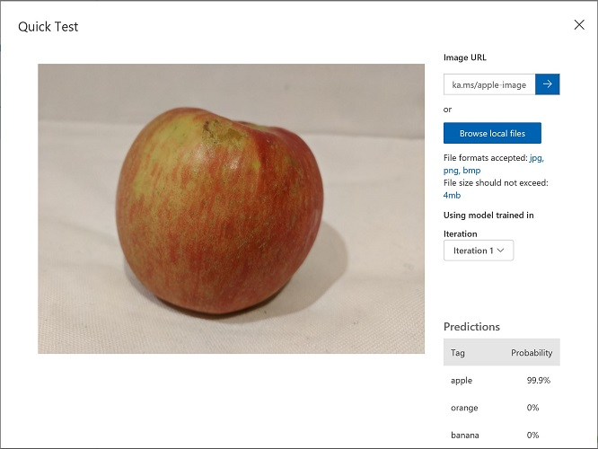
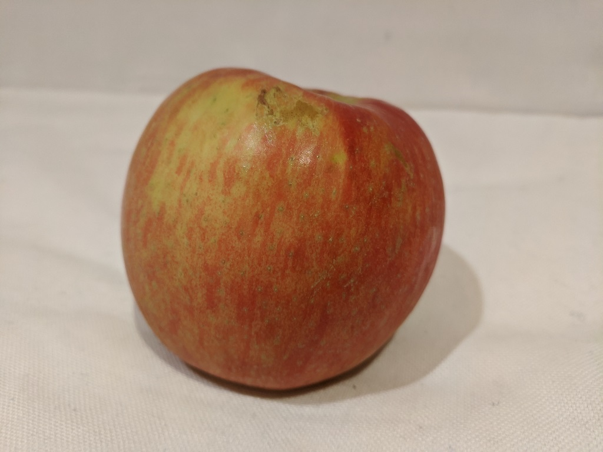

---
lab:
  title: Esplorare la funzionalità di classificazione immagini
  module: Module 3 - Computer Vision
---

# <a name="explore-image-classification"></a>Esplorare la funzionalità di classificazione immagini

> **Nota** Per completare questo lab, è necessaria una [sottoscrizione di Azure](https://azure.microsoft.com/free?azure-portal=true) in cui si ha accesso amministrativo.

Il servizio cognitivo *Visione artificiale* fornisce modelli predefiniti utili per l'uso delle immagini, ma sarà spesso necessario eseguire il training di un modello personalizzato per la visione artificiale. Si supponga, ad esempio, che l'azienda di vendita al dettaglio Northwind Traders voglia creare un sistema di checkout automatizzato che identifica i prodotti alimentari che i clienti vogliono acquistare in base a un'immagine scattata da una fotocamera al momento del checkout. A tale scopo, sarà necessario eseguire il training di un modello di classificazione che possa classificare le immagini per identificare il prodotto acquistato.

In Azure è possibile usare il servizio cognitivo ***Visione personalizzata*** per eseguire il training di un modello di classificazione delle immagini in base a immagini esistenti. Sono due gli elementi coinvolti nella creazione di una soluzione di classificazione delle immagini. Prima di tutto, è necessario eseguire il training di un modello per riconoscere classi diverse usando immagini esistenti. Dopo aver eseguito il training del modello è necessario pubblicarlo come servizio che può essere usato dalle applicazioni.

Per testare le funzionalità del servizio Visione personalizzata, verrà usata una semplice applicazione da riga di comando eseguita in Cloud Shell. Gli stessi principi e funzionalità sono applicabili a soluzioni reali, ad esempio siti Web o app per smartphone.

## <a name="create-a-cognitive-services-resource"></a>Creare una risorsa per *Servizi cognitivi*

È possibile usare il servizio Visione personalizzata creando una risorsa **Visione personalizzata** o una risorsa **Servizi cognitivi**.

>**Nota** Non tutte le risorse sono disponibili in tutte le aree. Indipendentemente dal fatto che si crei una risorsa Visione personalizzata o Servizi cognitivi, è possibile usare solo le risorse create in [determinate aree](https://azure.microsoft.com/global-infrastructure/services/?products=cognitive-services) per accedere ai servizi di Visione personalizzata. Per semplicità, è stata preselezionata un'area nelle istruzioni di configurazione riportate di seguito.

Creare una risorsa **Servizi cognitivi** nella sottoscrizione di Azure.

1. In un'altra scheda del browser aprire il portale di Azure all'indirizzo [https://portal.azure.com](https://portal.azure.com?azure-portal=true), eseguendo l'accesso con l'account Microsoft.

1. Fare clic sul pulsante **&65291;Crea una risorsa**, cercare *Servizi cognitivi* e creare una risorsa di **Servizi cognitivi** con le impostazioni seguenti:
    - **Sottoscrizione**: *la sottoscrizione di Azure usata*.
    - **Gruppo di risorse**: *selezionare o creare un nuovo gruppo di risorse con un nome univoco*.
    - **Area**: Stati Uniti orientali
    - **Nome**: *immettere un nome univoco*.
    - **Piano tariffario**: Standard S0
    - **Selezionando questa casella, confermo di aver letto e compreso tutte le condizioni seguenti**: selezionata.

1. Esaminare e creare la risorsa e attendere il completamento della distribuzione. Passare quindi alla risorsa distribuita.

1. Visualizzare la pagina **Chiavi ed endpoint** per la risorsa Servizi cognitivi. Sarà necessario specificare l'endpoint e le chiavi per la connessione dalle applicazioni client.

## <a name="create-a-custom-vision-project"></a>Creare un progetto di Visione personalizzata

Per eseguire il training di un modello di rilevamento degli oggetti, è necessario creare un progetto Visione personalizzata basato sulla risorsa di training. Per farlo, verrà usato il portale Custom Vision (Visione personalizzata).

1. Scaricare ed estrarre le immagini di training da https://aka.ms/fruit-images. Queste immagini vengono fornite in una cartella compressa che, dopo l'estrazione, contiene sottocartelle denominate **apple**, **banana** e **orange**.

1. In un'altra scheda del browser aprire il portale di Visione personalizzata all'indirizzo [https://customvision.ai](https://customvision.ai?azure-portal=true). Se richiesto, eseguire l'accesso usando l'account Microsoft associato alla sottoscrizione di Azure e accettare i termini del servizio.

1. Nel portale Custom Vision (Visione personalizzata) creare un nuovo progetto con le impostazioni seguenti:

    - **Nome**: Grocery Checkout
    - **Descrizione**: Image classification for groceries
    - **Risorsa**: *la risorsa di Visione personalizzata creata in precedenza*
    - **Tipi di progetto**: Classe
    - **Tipi di classificazione**: Multiclasse (un tag per immagine)
    - **Domini**: Food

1. Fare clic su **Aggiungi immagini** e selezionare tutti i file nella cartella **apple** estratta in precedenza. Caricare quindi i file di immagine specificando il tag *apple*, come di seguito:

    

1. Ripetere il passaggio precedente per caricare le immagini nella cartella **banana** con il tag *banana*, e le immagini nella cartella **orange** con il tag *orange*.

1. Esplorare le immagini che hai caricato nel progetto Visione personalizzata. Dovrebbero essere presenti 15 immagini di ogni classe, come di seguito:

    

1. Nel progetto Visione personalizzata, sopra le immagini, fare clic su **Train** (Esegui il training) per eseguire il training di un modello di classificazione usando le immagini con tag. Selezionare l'opzione **Quick Training** (Training rapido) e quindi attendere che l'iterazione del training venga completata (potrebbe essere necessario un minuto circa).

1. Al termine del training dell'iterazione del modello, esaminare le metriche di prestazione *Precision* (Precisione), *Recall* (Richiamo) e *AP*, che misurano l'accuratezza della previsione del modello di classificazione e dovrebbero essere tutte elevate.

## <a name="test-the-model"></a>Testare il modello

Prima di pubblicare questa iterazione del modello in modo che le applicazioni possano usarla, è consigliabile testarla.

1. Sopra le metriche di prestazione, fare clic su **Quick Test** (Test rapido).

1. Nella casella **URL immagine** digitare `https://aka.ms/apple-image` e fare clic su &#10132;

1. Visualizzare le previsioni restituite dal modello: il punteggio di probabilità per *apple* dovrebbe essere il più alto, come di seguito:

    

1. Chiudere la finestra **Quick Test** (Test rapido).

## <a name="publish-the-image-classification-model"></a>Pubblicare il modello di classificazione immagini

A questo punto è possibile pubblicare il modello sottoposto a training per poterlo usare da un'applicazione client.

1. Fare clic su **&128504; Pubblica** per pubblicare il modello sottoposto a training con le impostazioni seguenti:
    - **Nome modello**: groceries
    - **Risorsa di previsione**: *la risorsa di previsione creata in precedenza*.

1. Dopo la pubblicazione fare clic sull'icona dell'*URL di previsione* (&#127760;) per visualizzare le informazioni necessarie per usare il modello pubblicato. In seguito saranno necessari i valori appropriati per l'URL e la chiave di previsione per ottenere una stima da un URL immagine, quindi mantenere aperta questa finestra di dialogo e continuare con l'attività successiva. 

## <a name="run-cloud-shell"></a>Eseguire Cloud Shell

Per testare le funzionalità del servizio Visione personalizzata, verrà usata una semplice applicazione da riga di comando eseguita in Cloud Shell in Azure.

1. Nel portale di Azure selezionare il pulsante **[>_]** (*Cloud Shell*) nella parte superiore della pagina a destra della casella di ricerca. Verrà aperto un riquadro di Cloud Shell nella parte inferiore del portale. 

    

1. La prima volta che si apre Cloud Shell, è possibile che venga chiesto di scegliere il tipo di shell da usare (*Bash* o *PowerShell*). Selezionare **PowerShell**. Se questa opzione non viene visualizzata, ignorare il passaggio.  

1. Se viene chiesto di creare una risorsa di archiviazione per Cloud Shell, assicurarsi che sia specificata la sottoscrizione corretta e selezionare **Crea risorsa di archiviazione**. Attendere circa un minuto che la risorsa di archiviazione venga creata.

    [](media/create-image-classification-system/powershell-portal-guide-2.png#lightbox)

1. Verificare che nella parte superiore sinistra del riquadro di Cloud Shell sia impostato *PowerShell* come tipo di shell. Se è *Bash*, passare a *PowerShell* usando il menu a discesa.

    

1. Attendere l'avvio di PowerShell. Nel portale di Azure verrà visualizzata la schermata seguente:  

    

## <a name="configure-and-run-a-client-application"></a>Configurare ed eseguire un'applicazione client

Ora che si dispone di un ambiente Cloud Shell, è possibile eseguire una semplice applicazione che usa il servizio Visione personalizzata per analizzare un'immagine.

1. Nella shell dei comandi immettere il comando seguente per scaricare l'applicazione di esempio e salvarla in una cartella denominata ai-900. 

    ```PowerShell
    git clone https://github.com/MicrosoftLearning/AI-900-AIFundamentals ai-900
    ```

    >**Suggerimento** Se questo comando è già stato usato in un altro lab per clonare il repository *ai-900*, è possibile ignorare questo passaggio.

1. I file vengono scaricati in una cartella denominata **ai-900**. Ora si vogliono visualizzare tutti i file disponibili nella risorsa di archiviazione di Cloud Shell e usarli. Digitare il comando seguente nella shell:

    ```PowerShell
    code .
    ```

    Verrà aperto un editor come quello illustrato nell'immagine seguente: 

    

1. Nel riquadro **File** a sinistra espandere **ai-900** e selezionare **classify-image.ps1**. Questo file contiene codice che usa il modello di Visione personalizzata per analizzare un'immagine, come illustrato di seguito:

     

1. Non preoccuparsi troppo dei dettagli del codice, è importante notare che sono necessari l'URL e la chiave di previsione per il modello di Visione personalizzata quando si usa un URL immagine. 

   Ottenere l'*URL di previsione* dalla finestra di dialogo nel progetto Visione personalizzata. 

   >**Nota** Tenere presente che l'*URL di previsione* è stato modificato dopo aver pubblicato il modello di classificazione delle immagini. Per trovare l'*URL di previsione*, passare alla scheda **Performance** nel progetto e quindi fare clic su **Prediction URL** (se la schermata è compressa, potrebbe essere visibile solo un'icona a forma di globo). Verrà visualizzata una finestra di dialogo. Copiare l'URL per **If you have an image URL**. Incollarlo nell'editor di codice, sostituendo **YOUR_PREDICTION_URL**.

    Usare la stessa finestra di dialogo per ottenere la *chiave di previsione*. Copiare la chiave di previsione visualizzata dopo *Set Prediction-Key Header to*. Incollarla nell'editor di codice, sostituendo il valore segnaposto **YOUR_PREDICTION_KEY**.

    

    Dopo aver incollato i valori di URL di previsione e chiave di previsione, le prime due righe di codice dovrebbero essere simili a questa:

    ```PowerShell
    $predictionUrl="https..."
    $predictionKey ="1a2b3c4d5e6f7g8h9i0j...."
    ```

1. In alto a destra nel riquadro dell'editor fare clic sul pulsante **...** per aprire il menu e selezionare **Salva** per salvare le modifiche. Aprire di nuovo il menu e selezionare **Close Editor**.

    Si userà l'applicazione client di esempio per classificare diverse immagini nella categoria apple, banana o orange.

1. Verrà classificata questa immagine:

    

    Nel riquadro di PowerShell immettere i comandi seguenti per eseguire il codice:

    ```PowerShell
    cd ai-900
    ./classify-image.ps1 1
    ```

1. Esaminare la previsione, che dovrebbe essere **apple**.

1. Proviamo ora un'altra immagine:

    

    Eseguire questo comando:

    ```PowerShell
    ./classify-image.ps1 2
    ```

1. Verificare che il modello classifichi questa immagine come **banana**.

1. Infine, si proverà la terza immagine di prova:

    

    Eseguire questo comando:

    ```PowerShell
    ./classify-image.ps1 3
    ```

1. Verificare che il modello classifichi questa immagine come **orange**.

## <a name="learn-more"></a>Altre informazioni

Questa semplice app mostra solo alcune delle funzionalità del servizio Visione personalizzata. Per altre informazioni su cosa è possibile fare con questo servizio, vedere la [pagina del servizio Visione personalizzata](https://azure.microsoft.com/services/cognitive-services/custom-vision-service/).
