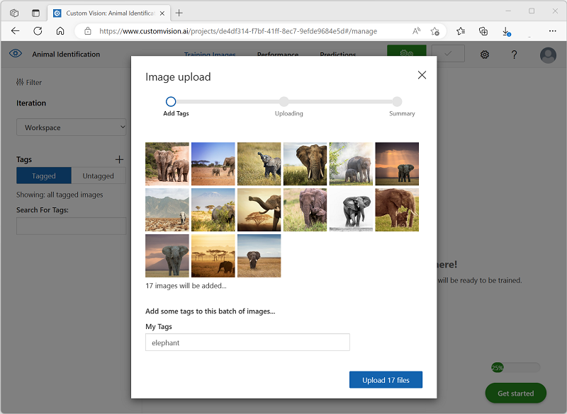
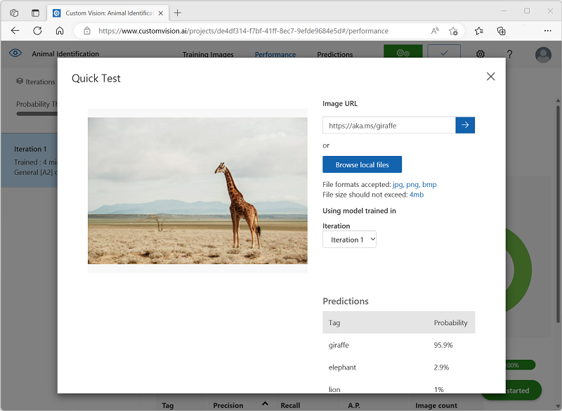

---
lab:
  title: Esplorare la funzionalità di classificazione immagini
---

# Esplorare la funzionalità di classificazione immagini

Il *servizio Visione* artificiale di Azure offre utili modelli predefiniti per l'uso delle immagini, ma spesso è necessario eseguire il training del proprio modello per la visione artificiale. Si supponga, ad esempio, che un'organizzazione di conservazione della fauna selvatica voglia tenere traccia degli avvistamenti degli animali usando fotocamere sensibili al movimento. Le immagini acquisite dalle telecamere potrebbero quindi essere usate per verificare la presenza di specie particolari in una particolare zona e assistere agli sforzi di conservazione per le specie in via di estinzione. A tale scopo, l'organizzazione trarrebbe vantaggio da un *modello di classificazione* delle immagini sottoposto a training per identificare diverse specie di animali nelle fotografie acquisite.

In Azure è possibile usare il servizio Visione personalizzata*** per eseguire il ***training di un modello di classificazione delle immagini in base alle immagini esistenti. Sono due gli elementi coinvolti nella creazione di una soluzione di classificazione delle immagini. Prima di tutto, è necessario eseguire il training di un modello per riconoscere classi diverse usando immagini esistenti. Dopo aver eseguito il training del modello è necessario pubblicarlo come servizio che può essere usato dalle applicazioni.

Per testare le funzionalità del servizio Visione personalizzata, verrà usata una semplice applicazione da riga di comando eseguita in Cloud Shell. Gli stessi principi e funzionalità si applicano in soluzioni reali, ad esempio siti Web o app per dispositivi mobili.

## Prima di iniziare

Per completare questo lab, è necessaria una [sottoscrizione di Azure](https://azure.microsoft.com/free?azure-portal=true) in cui si ha accesso amministrativo.

## Creare una *risorsa dei servizi* di intelligenza artificiale di Azure

È possibile usare il servizio Visione personalizzata creando una risorsa Visione personalizzata** o una ****risorsa dei servizi** di intelligenza artificiale di Azure.

>**Nota** Non tutte le risorse sono disponibili in tutte le aree. Sia che si crei un Visione personalizzata o una risorsa dei servizi di intelligenza artificiale di Azure, è possibile usare solo le risorse create in [determinate aree](https://azure.microsoft.com/global-infrastructure/services/?products=cognitive-services) per accedere ai servizi Visione personalizzata. Per semplicità, è stata preselezionata un'area nelle istruzioni di configurazione riportate di seguito.

Creare una **risorsa dei servizi** di intelligenza artificiale di Azure nella sottoscrizione di Azure.

1. Aprire il portale di Azure all'indirizzo [https://portal.azure.com](https://portal.azure.com?azure-portal=true), eseguendo l'accesso con l'account Microsoft.

1. Fare clic sul **&#65291; Creare un pulsante di risorsa e cercare i servizi* di intelligenza** artificiale di *Azure. Selezionare **Crea** un **piano di servizi** di intelligenza artificiale di Azure. Verrà visualizzata una pagina per creare una risorsa dei servizi di intelligenza artificiale di Azure. Configurarlo con le impostazioni seguenti:
    - **Sottoscrizione**: *la sottoscrizione di Azure usata*.
    - **Gruppo di risorse**: *selezionare o creare un nuovo gruppo di risorse con un nome univoco*.
    - **Area**: Stati Uniti orientali
    - **Nome**: *immettere un nome univoco*.
    - **Piano tariffario**: Standard S0
    - **Selezionando questa casella, confermo di aver letto e compreso tutte le condizioni seguenti**: selezionata.

1. Esaminare e creare la risorsa e attendere il completamento della distribuzione. Passare quindi alla risorsa distribuita.

1. Visualizzare la **pagina Chiavi ed endpoint** per la risorsa dei servizi di intelligenza artificiale di Azure. Sarà necessario specificare l'endpoint e le chiavi per la connessione dalle applicazioni client.

## Creare un progetto di Visione personalizzata

Per eseguire il training di un modello di rilevamento oggetti, è necessario creare un progetto Visione personalizzata basato sulla risorsa di training. A tale scopo, si userà il portale di Visione personalizzata.

1. Scaricare ed estrarre le immagini di training da [https://aka.ms/animal-images](https://aka.ms/animal-images). Queste immagini vengono fornite in una cartella compressa, che quando estratta contiene sottocartelle denominate **elefante**, **giraffe** e **leone**.

1. Aprire una nuova scheda del browser e passare al portale di Visione personalizzata all'indirizzo [https://customvision.ai](https://customvision.ai?azure-portal=true). Se richiesto, accedere usando l'account Microsoft associato alla sottoscrizione di Azure e accettare le condizioni per il servizio.

1. Nel portale di Visione personalizzata creare un nuovo progetto con le impostazioni seguenti:

    - **Nome**: Identificazione animale
    - **Descrizione**: Classificazione delle immagini per gli animali
    - **Risorsa**: *i servizi di intelligenza artificiale di Azure o la risorsa Visione personalizzata creata in precedenza*
    - **Tipi di** progetto: classificazione
    - **Tipi di classificazione**: Multiclasse (un tag per immagine)
    - **Domini**: Generale \[A2]

1. Fare clic su **Aggiungi immagini** e selezionare tutti i file nella **cartella elephant** estratta in precedenza. Caricare quindi i file di immagine, specificando il tag *elephant*, come illustrato di seguito:

    

1. Usare il **pulsante Aggiungi immagini** ([+]) per caricare le immagini nella **cartella giraffe con il tag *giraffe*** e le immagini nella **cartella leone con il leone***.*

1. Esplorare le immagini caricate nel progetto Visione personalizzata. Dovrebbero essere presenti 17 immagini di ogni classe, come illustrato di seguito:

    

1. Nel progetto Visione personalizzata, sopra le immagini, fare clic su **Esegui** training per eseguire il training di un modello di classificazione usando le immagini con tag. Selezionare l'opzione **Training** rapido e attendere il completamento dell'iterazione di training.

    > **Suggerimento**: il training potrebbe richiedere alcuni minuti. Durante l'attesa, vedere [How snow leopard selfies and AI can help save the species from estinzione](https://news.microsoft.com/transform/snow-leopard-selfies-ai-save-species/), che descrive un vero progetto che usa la visione artificiale per tenere traccia degli animali in pericolo in natura.

1. Quando è stato eseguito il training dell'iterazione del modello, esaminare le *metriche delle prestazioni precisione*, *richiamo* e *API* , che misurano l'accuratezza della stima del modello di classificazione e devono essere tutte elevate.

## Test del modello

Prima di pubblicare questa iterazione del modello in modo che le applicazioni possano usarla, è consigliabile testarla.

1. Sopra le metriche delle prestazioni fare clic su **Test** rapido.

1. Nella **casella URL** immagine digitare `https://aka.ms/giraffe` e fare clic sul **pulsante immagine di test rapido (&#10132;).**

1. Visualizzare le stime restituite dal modello: il punteggio di probabilità per *la giraffe* deve essere il più alto, come illustrato di seguito:

    

1. Chiudere la **finestra Test** rapido.

## Pubblicare il modello di classificazione immagini

A questo punto è possibile pubblicare il modello sottoposto a training per poterlo usare da un'applicazione client.

1. Fare clic su **&128504; Pubblica** per pubblicare il modello sottoposto a training con le impostazioni seguenti:
    - **** Nome modello: animali
    - **Risorsa di stima: *i servizi di intelligenza** artificiale di Azure o Visione personalizzata risorsa di stima creata in precedenza*.

1. Dopo la pubblicazione fare clic sull'icona dell'*URL di previsione* (&#127760;) per visualizzare le informazioni necessarie per usare il modello pubblicato.

    

In seguito saranno necessari i valori appropriati per l'URL e la chiave di previsione per ottenere una stima da un URL immagine, quindi mantenere aperta questa finestra di dialogo e continuare con l'attività successiva.

## Preparare un'applicazione client

Per testare le funzionalità del servizio Visione personalizzata, si userà una semplice applicazione da riga di comando eseguita in Cloud Shell in Azure.

1. Tornare alla scheda del browser contenente il portale di Azure e selezionare il **pulsante Cloud Shell** (**[>_]**) nella parte superiore della pagina a destra della casella di ricerca. Verrà aperto un riquadro cloud shell nella parte inferiore del portale.

    La prima volta che si apre Cloud Shell, è possibile che venga chiesto di scegliere il tipo di shell da usare (*Bash* o *PowerShell*). In tal caso, selezionare **PowerShell**.

    Se viene richiesto di creare l'archiviazione per Cloud Shell, assicurarsi che la sottoscrizione sia selezionata e selezionare Crea archiviazione****. Attendere circa un minuto che la risorsa di archiviazione venga creata.

    Quando Cloud Shell è pronto, dovrebbe essere simile al seguente:
    
    

    > **Suggerimento**: assicurarsi che il tipo di shell indicato in alto a sinistra nel riquadro di Cloud Shell sia *PowerShell*. Se è *Bash*, passare a *PowerShell* usando il menu a discesa.

    Si noti che è possibile ridimensionare Cloud Shell trascinando la barra di separazione nella parte superiore del riquadro o usando le icone **&#8212;**, **&#9723;** e **X** nell'angolo in alto a destra del riquadro per ridurre a icona, ingrandire o chiudere il riquadro. Per altre informazioni sull'uso di Azure Cloud Shell, vedere la [documentazione su Azure Cloud Shell](https://docs.microsoft.com/azure/cloud-shell/overview).

2. Nella shell dei comandi immettere i comandi seguenti per scaricare i file per questo esercizio e salvarli in una cartella denominata **ai-900** (dopo aver rimosso la cartella, se già esistente)

    ```PowerShell
    rm -r ai-900 -f
    git clone https://github.com/MicrosoftLearning/AI-900-AIFundamentals ai-900
    ```

3. Dopo aver scaricato i file, immettere i comandi seguenti per passare alla **directory ai-900** e modificare il file di codice per questo esercizio:

    ```PowerShell
    cd ai-900
    code classify-image.ps1
    ```

    Si noti che viene aperto un editor simile a quello nell'immagine seguente:

     

     > **Suggerimento**: è possibile usare la barra separatore tra la riga di comando di Cloud Shell e l'editor di codice per ridimensionare i riquadri.

4. Non prestare attenzione eccessiva ai dettagli del codice. L'aspetto importante è che inizia con un codice per specificare l'URL di stima e la chiave per il modello di Visione personalizzata. È necessario aggiornarli in modo che il resto del codice usi il modello.

    Ottenere l'URL ** di stima e *la chiave* di stima dalla finestra di dialogo aperta nella scheda del browser per il progetto Visione personalizzata. **Se si dispone di un URL* di immagine, è necessario usare *le versioni.**

    Usare questi valori per sostituire i **YOUR_PREDICTION_URL** e **YOUR_PREDICTION_KEY** segnaposto nel file di codice.

    Dopo aver incollato i valori dell'URL e della chiave di previsione, le prime due righe di codice dovrebbero essere simili a questa:

    ```PowerShell
    $predictionUrl="https..."
    $predictionKey ="1a2b3c4d5e6f7g8h9i0j...."
    ```

5. Dopo aver apportato le modifiche alle variabili nel codice, premere **CTRL+S** per salvare il file. Premere **QUINDI CTRL+Q** per chiudere l'editor di codice.

## Testare l'applicazione client

È ora possibile usare l'applicazione client di esempio per classificare le immagini in base all'animale che contengono.

1. Nel riquadro di PowerShell immettere il comando seguente per eseguire il codice:

    ```PowerShell
    ./classify-image.ps1 1
    ```

    Questo codice usa il modello per classificare l'immagine seguente:

    

1. Esaminare la stima, che dovrebbe essere **giraffe**.

1. Ora proviamo un'altra immagine. Esegui questo comando:

    ```PowerShell
    ./classify-image.ps1 2
    ```

    Questa volta viene classificata l'immagine seguente:

    

1. Verificare che il modello classifica questa immagine come **elefante**.

1. Proviamo un altro. Esegui questo comando:

    ```PowerShell
    ./classify-image.ps1 3
    ```

    L'immagine finale è simile alla seguente:

    

1. Verificare che il modello classifica questa immagine come **leone**.

Si spera che il modello di classificazione delle immagini classifica correttamente tutte e tre le immagini.


