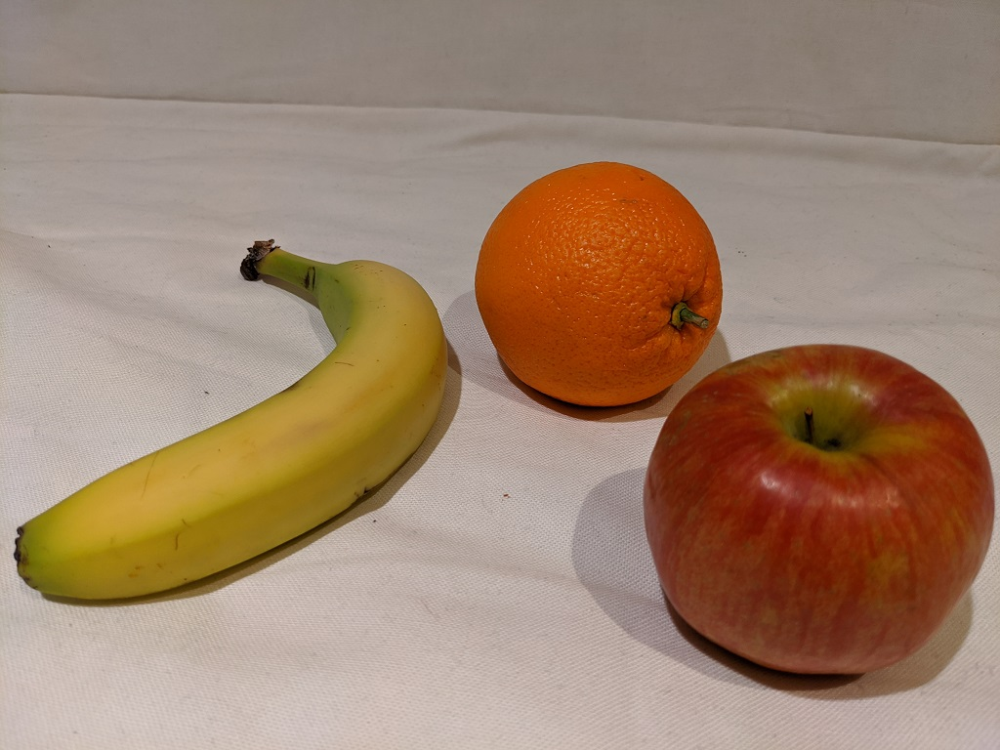

---
lab:
  title: Esplorare la funzionalità di rilevamento oggetti
  module: Module 3 - Computer Vision
---

# <a name="explore-object-detection"></a>Esplorare la funzionalità di rilevamento oggetti

> **Nota** Per completare questo lab, è necessaria una [sottoscrizione di Azure](https://azure.microsoft.com/free?azure-portal=true) in cui si ha accesso amministrativo.

              Il *rilevamento oggetti* è una forma di visione artificiale in cui viene eseguito il training di un modello di Machine Learning per classificare singole istanze di oggetti in un'immagine e indicare un *rettangolo delimitatore* che ne contrassegna la posizione. È possibile considerarlo come un'evoluzione della *classificazione immagini* (in cui il modello risponde alla domanda "a cosa corrisponde questa immagine?") per la creazione di soluzioni in cui è possibile porre al modello la domanda "quali oggetti sono presenti in questa immagine e dove si trovano?".

Ad esempio, un negozio di alimentari potrebbe usare un modello di rilevamento degli oggetti per implementare un sistema di cassa automatizzato che scansiona un nastro trasportatore usando una telecamera ed è in grado di identificare articoli specifici senza la necessità di posizionare ogni articolo sul nastro e scansionarlo singolarmente.

Il servizio cognitivo **Visione personalizzata** disponibile in Microsoft Azure offre una soluzione basata sul cloud per la creazione e la pubblicazione di modelli di rilevamento oggetti personalizzati. In Azure è possibile usare il servizio Visione personalizzata per eseguire il training di un modello di classificazione delle immagini in base a immagini esistenti. Sono due gli elementi coinvolti nella creazione di una soluzione di classificazione delle immagini. Prima di tutto, è necessario eseguire il training di un modello per riconoscere classi diverse usando immagini esistenti. Dopo aver eseguito il training del modello è necessario pubblicarlo come servizio che può essere usato dalle applicazioni.

Per testare le funzionalità del servizio Visione personalizzata per il rilevamento di oggetti nelle immagini, verrà usata una semplice applicazione da riga di comando eseguita in Cloud Shell. Gli stessi principi e funzionalità sono applicabili a soluzioni reali, ad esempio siti Web o app per smartphone.

## <a name="create-a-cognitive-services-resource"></a>Creare una risorsa per *Servizi cognitivi*

È possibile usare il servizio Visione personalizzata creando una risorsa **Visione personalizzata** o una risorsa **Servizi cognitivi**.

> **Nota** Non tutte le risorse sono disponibili in tutte le aree. Indipendentemente dal fatto che si crei una risorsa Visione personalizzata o Servizi cognitivi, è possibile usare solo le risorse create in [determinate aree](https://azure.microsoft.com/global-infrastructure/services/?products=cognitive-services) per accedere ai servizi di Visione personalizzata. Per semplicità, è stata preselezionata un'area nelle istruzioni di configurazione riportate di seguito.

Creare una risorsa **Servizi cognitivi** nella sottoscrizione di Azure.

1. In un'altra scheda del browser aprire il portale di Azure all'indirizzo [https://portal.azure.com](https://portal.azure.com?azure-portal=true), eseguendo l'accesso con l'account Microsoft.

1. Fare clic sul pulsante **&65291;Crea una risorsa**, cercare *Servizi cognitivi* e creare una risorsa di **Servizi cognitivi** con le impostazioni seguenti:
    - **Sottoscrizione**: *la sottoscrizione di Azure usata*.
    - **Gruppo di risorse**: *selezionare o creare un nuovo gruppo di risorse con un nome univoco*.
    - **Area**: Stati Uniti orientali
    - **Nome**: *immettere un nome univoco*.
    - **Piano tariffario**: Standard S0
    - **Selezionando questa casella, confermo di aver letto e compreso tutte le condizioni seguenti**: selezionata.

1. Esaminare e creare la risorsa e attendere il completamento della distribuzione. Passare quindi alla risorsa distribuita.

1. Visualizzare la pagina **Chiavi ed endpoint** per la risorsa Servizi cognitivi. Sarà necessario specificare l'endpoint e le chiavi per la connessione dalle applicazioni client.

## <a name="create-a-custom-vision-project"></a>Creare un progetto di Visione personalizzata

Per eseguire il training di un modello di rilevamento degli oggetti, è necessario creare un progetto Visione personalizzata basato sulla risorsa di training. Per farlo, verrà usato il portale Custom Vision (Visione personalizzata).

1. In una nuova scheda del browser aprire il portale di Visione personalizzata all'indirizzo [https://customvision.ai](https://customvision.ai?azure-portal=true) ed eseguire l'accesso usando l'account Microsoft associato alla sottoscrizione di Azure.

1. Creare un nuovo progetto con le impostazioni seguenti:
    - **Nome**: Grocery Detection
    - **Descrizione**: Object detection for groceries.
    - **Risorsa**: *la risorsa creata in precedenza*
    - **Tipi di progetto**: Rilevamento oggetti
    - **Domini**: General (Generale)

1. Attendere che il progetto venga creato e aperto nel browser.

## <a name="add-and-tag-images"></a>Aggiungere le immagini e aggiungere i tag

Per eseguire il training di un modello di rilevamento degli oggetti, è necessario caricare le immagini che contengono le classi che si vuole identificare tramite il modello e aggiungervi tag per indicare i riquadri di delimitazione per ogni istanza dell'oggetto.

1. Scaricare ed estrarre le immagini di training da https://aka.ms/fruit-objects. La cartella estratta contiene una raccolta di immagini di frutta.

1. Nel portale di Visione personalizzata [https://customvision.ai](https://customvision.ai?azure-portal=true) assicurarsi di lavorare nel progetto di rilevamento oggetti _Grocery Detection_. Selezionare quindi **Aggiungi immagini** e caricare tutte le immagini nella cartella estratta.

    

1. Al termine del caricamento delle immagini selezionare la prima per aprirla.

1. Posizionare il mouse su qualsiasi oggetto nell'immagine fino a quando viene visualizzata un'area rilevata automaticamente come nell'immagine seguente. Selezionare quindi l'oggetto e, se necessario, ridimensionare l'area per circondarlo.

    

    In alternativa, è possibile semplicemente trascinare il mouse intorno all'oggetto per creare un'area.

1. Quando l'area circonda l'oggetto, aggiungere un nuovo tag con il tipo di oggetto appropriato (*apple*, *banana* o *orange*) come mostrato di seguito:

    

1. Selezionare ogni altro oggetto nell'immagine e aggiungere i tag, ridimensionando le aree e aggiungendo nuovi tag come necessario.

    

1. Usare il collegamento **>** sulla destra per passare all'immagine successiva e aggiungere un tag ai relativi oggetti. Continuare così per tutta la raccolta di immagini, aggiungendo un tag a ogni mela, banana e arancia.

1. Dopo aver finito di aggiungere tag all'ultima immagine, chiudere l'editor **Image Detail** (Dettaglio immagine) e nella pagina **Training Images** (Immagini training), in **Tags** (Tag), selezionare **Tagged** (Con tag) per vedere tutte le tue immagini con tag:

    

## <a name="train-and-test-a-model"></a>Eseguire il training e il test di un modello

Dopo aver aggiunto tag alle immagini nel progetto, si è pronti per eseguire il training di un modello.

1. Nel progetto Visione personalizzata, fare clic su **Train** (Esegui il training) per eseguire il training di un modello di rilevamento degli oggetti usando le immagini con tag. Selezionare l'opzione **Quick Training** (Training rapido).

1. Attendere il completamento del training, che potrebbe richiedere circa 10 minuti, quindi esaminare le metriche delle prestazioni *Precision* (Precisione), *Recall* (Richiamo) e *AP*, che misurano la validità della stima del modello di classificazione e i cui valori dovrebbero essere tutti elevati.

1. In alto a destra nella pagina fare clic su **Test rapido** e quindi nella casella **URL immagine** immettere `https://aka.ms/apple-orange` e visualizzare la previsione generata. Chiudere quindi la finestra **Quick Test** (Test rapido).

## <a name="publish-the-object-detection-model"></a>Pubblicare il modello di rilevamento oggetti

A questo punto è possibile pubblicare il modello sottoposto a training per poterlo usare da un'applicazione client.

1. Fare clic su **&128504; Pubblica** per pubblicare il modello sottoposto a training con le impostazioni seguenti:
    - **Nome del modello**: detect-produce
    - **Risorsa di previsione**: *la risorsa creata in precedenza*.

1. Dopo la pubblicazione fare clic sull'icona dell'*URL di previsione* (&#127760;) per visualizzare le informazioni necessarie per usare il modello pubblicato. In seguito saranno necessari i valori appropriati per l'URL e la chiave di previsione per ottenere una stima da un URL immagine, quindi mantenere aperta questa finestra di dialogo e continuare con l'attività successiva.

## <a name="run-cloud-shell"></a>Eseguire Cloud Shell

Per testare le funzionalità del servizio Visione personalizzata, verrà usata una semplice applicazione da riga di comando eseguita in Cloud Shell in Azure.

1. Nel portale di Azure selezionare il pulsante **[>_]** (*Cloud Shell*) nella parte superiore della pagina a destra della casella di ricerca. Verrà aperto un riquadro di Cloud Shell nella parte inferiore del portale. 

    

1. La prima volta che si apre Cloud Shell, è possibile che venga chiesto di scegliere il tipo di shell da usare (*Bash* o *PowerShell*). Selezionare **PowerShell**. Se questa opzione non viene visualizzata, ignorare il passaggio.  

1. Se viene chiesto di creare una risorsa di archiviazione per Cloud Shell, assicurarsi che sia specificata la sottoscrizione corretta e selezionare **Crea risorsa di archiviazione**. Attendere circa un minuto che la risorsa di archiviazione venga creata.

    

1. Verificare che nella parte superiore sinistra del riquadro Cloud Shell sia impostato *PowerShell* come tipo di shell. Se è *Bash*, passare a *PowerShell* usando il menu a discesa.

     

1. Attendere l'avvio di PowerShell. Nel portale di Azure verrà visualizzata la schermata seguente:  

     

## <a name="configure-and-run-a-client-application"></a>Configurare ed eseguire un'applicazione client

Ora che si dispone di un modello personalizzato, è possibile eseguire una semplice applicazione client che usa il servizio Visione personalizzata per rilevare oggetti in un'immagine.

1. Nella shell dei comandi immettere il comando seguente per scaricare l'applicazione di esempio e salvarla in una cartella denominata ai-900.

    ```PowerShell
    git clone https://github.com/MicrosoftLearning/AI-900-AIFundamentals ai-900
    ```

    >**Nota** Se questo comando è già stato usato in un altro lab per clonare il repository *ai-900*, è possibile ignorare questo passaggio.

1. I file vengono scaricati in una cartella denominata **ai-900**. Ora si vogliono visualizzare tutti i file disponibili nella risorsa di archiviazione di Cloud Shell e usarli. Digitare il comando seguente nella shell:

    ```PowerShell
    code .
    ```

    Verrà aperto un editor come quello illustrato nell'immagine seguente: 

    

1. Nel riquadro **File** a sinistra espandere **ai-900** e selezionare **detect-objects.ps1**. Questo file contiene codice che usa il servizio Visione personalizzata per rilevare oggetti in un'immagine, come illustrato di seguito:

    

1. Non preoccuparsi troppo dei dettagli del codice, è importante notare che sono necessari l'URL e la chiave di previsione per il modello di Visione personalizzata quando si usa un URL immagine. 

    Ottenere l'*URL di previsione* dalla finestra di dialogo nel progetto Visione personalizzata. 

    >**Nota** Tenere presente che l'*URL di previsione* è stato modificato dopo aver pubblicato il modello di classificazione delle immagini. Per trovare l'*URL di previsione*, passare alla scheda **Performance** nel progetto e quindi fare clic su **Prediction URL** (se la schermata è compressa, potrebbe essere visibile solo un'icona a forma di globo). Verrà visualizzata una finestra di dialogo. Copiare l'URL per **If you have an image URL**. Incollarlo nell'editor di codice, sostituendo **YOUR_PREDICTION_URL**. 

    Usare la stessa finestra di dialogo per ottenere la *chiave di previsione*. Copiare la chiave di previsione visualizzata dopo *Set Prediction-Key Header to*. Incollarla nell'editor di codice, sostituendo il valore segnaposto **YOUR_PREDICTION_KEY**. 

    

    Dopo aver incollato i valori di URL di previsione e chiave di previsione, le prime due righe di codice dovrebbero essere simili a questa:

    ```PowerShell
    $predictionUrl="https..."
    $predictionKey ="1a2b3c4d5e6f7g8h9i0j...."
    ```

1. In alto a destra nel riquadro dell'editor fare clic sul pulsante **...** per aprire il menu e selezionare **Salva** per salvare le modifiche. Aprire di nuovo il menu e selezionare **Close Editor**.

    Si userà l'applicazione client di esempio per rilevare gli oggetti in questa immagine:

    

1. Nel riquadro di PowerShell immettere il comando seguente per eseguire il codice:

    ```PowerShell
    cd ai-900
    ./detect-objects.ps1 
    ```

1. Esaminare la previsione, che dovrebbe essere *apple orange banana*.

## <a name="learn-more"></a>Altre informazioni

Questa semplice app mostra solo alcune delle funzionalità del servizio Visione personalizzata. Per altre informazioni su cosa è possibile fare con questo servizio, vedere la [pagina del servizio Visione personalizzata](https://azure.microsoft.com/services/cognitive-services/custom-vision-service/).
