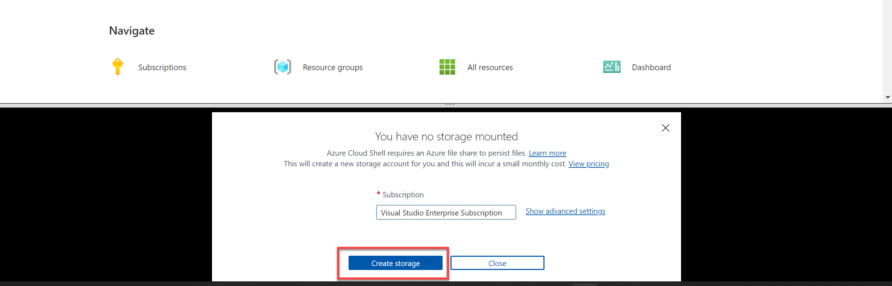

---
lab:
  title: Esplorare il riconoscimento ottico dei caratteri
---

# <a name="explore-optical-character-recognition"></a>Esplorare il riconoscimento ottico dei caratteri

> **Nota** Per completare questo lab, è necessaria una [sottoscrizione di Azure](https://azure.microsoft.com/free?azure-portal=true) in cui si ha accesso amministrativo.

Il rilevamento e l'interpretazione del testo in un'immagine rappresentano una sfida comune per i sistemi di visione artificiale. Questo tipo di elaborazione viene spesso definito *riconoscimento ottico dei caratteri* (OCR). L'API Lettura di Microsoft fornisce l'accesso alle funzionalità OCR. 

Per testare le funzionalità dell'API Lettura, verrà usata una semplice applicazione da riga di comando eseguita in Cloud Shell. Gli stessi principi e funzionalità sono applicabili a soluzioni reali, ad esempio siti Web o app per smartphone.

## <a name="use-the-computer-vision-service-to-read-text-in-an-image"></a>Usare il servizio Visione artificiale per leggere il testo in un'immagine

Il servizio cognitivo **Visione artificiale** offre supporto per le attività OCR, tra cui:

- Un'API di **lettura** ottimizzata per documenti di dimensioni maggiori. Questa API viene usata in modo asincrono e può essere usata sia per il testo stampato che per quello scritto a mano.

## <a name="create-a-cognitive-services-resource"></a>Creare una risorsa *Servizi cognitivi*

È possibile usare il servizio Visione artificiale creando una risorsa **Visione artificiale** o una risorsa **Servizi cognitivi**.

Se non è già stato fatto, creare una risorsa **Servizi cognitivi** nella sottoscrizione di Azure.

1. In un'altra scheda del browser aprire il portale di Azure all'indirizzo [https://portal.azure.com](https://portal.azure.com?azure-portal=true), eseguendo l'accesso con l'account Microsoft.

1. Fare clic sul pulsante **&65291;Crea una risorsa**, cercare *Servizi cognitivi* e creare una risorsa di **Servizi cognitivi** con le impostazioni seguenti:
    - **Sottoscrizione**: *la sottoscrizione di Azure usata*.
    - **Gruppo di risorse**: *selezionare o creare un nuovo gruppo di risorse con un nome univoco*.
    - **Area**: *scegliere una qualsiasi area disponibile*.
    - **Nome**: *immettere un nome univoco*.
    - **Piano tariffario**: Standard S0
    - **Selezionando questa casella, confermo di aver letto e compreso tutte le condizioni seguenti**: selezionata.

1. Esaminare e creare la risorsa e attendere il completamento della distribuzione. Passare quindi alla risorsa distribuita.

1. Visualizzare la pagina **Chiavi ed endpoint** per la risorsa Servizi cognitivi. Sarà necessario specificare l'endpoint e le chiavi per la connessione dalle applicazioni client.

## <a name="run-cloud-shell"></a>Eseguire Cloud Shell

Per testare le funzionalità del servizio Visione personalizzata, verrà usata una semplice applicazione da riga di comando eseguita in Cloud Shell in Azure.

1. Nel portale di Azure selezionare il pulsante **[>_]** (*Cloud Shell*) nella parte superiore della pagina a destra della casella di ricerca. Verrà aperto un riquadro di Cloud Shell nella parte inferiore del portale. 

    

1. La prima volta che si apre Cloud Shell, è possibile che venga chiesto di scegliere il tipo di shell da usare (*Bash* o *PowerShell*). Selezionare **PowerShell**. Se questa opzione non viene visualizzata, ignorare il passaggio.  

1. Se viene chiesto di creare una risorsa di archiviazione per Cloud Shell, assicurarsi che sia specificata la sottoscrizione corretta e selezionare **Crea risorsa di archiviazione**. Attendere circa un minuto che la risorsa di archiviazione venga creata.

    

1. Verificare che nella parte superiore sinistra del riquadro di Cloud Shell sia impostato *PowerShell* come tipo di shell. Se è *Bash*, passare a *PowerShell* usando il menu a discesa.

     

1. Attendere l'avvio di PowerShell. Nel portale di Azure verrà visualizzata la schermata seguente:  

     

## <a name="configure-and-run-a-client-application"></a>Configurare ed eseguire un'applicazione client

Ora che si dispone di un modello personalizzato, è possibile eseguire una semplice applicazione client che usa il servizio OCR.

1. Nella shell dei comandi immettere il comando seguente per scaricare l'applicazione di esempio e salvarla in una cartella denominata ai-900.

    ```PowerShell
    git clone https://github.com/MicrosoftLearning/AI-900-AIFundamentals ai-900
    ```

    >**Suggerimento** Se questo comando è già stato usato in un altro lab per clonare il repository *ai-900*, è possibile ignorare questo passaggio.

1. I file vengono scaricati in una cartella denominata **ai-900**. Ora si vogliono visualizzare tutti i file disponibili nella risorsa di archiviazione di Cloud Shell e usarli. Digitare il comando seguente nella shell:

    ```PowerShell
    code .
    ```

    Verrà aperto un editor come quello illustrato nell'immagine seguente: 

    

1. Nel riquadro **File** a sinistra espandere **ai-900** e selezionare **ocr.ps1**. Questo file contiene codice che usa il servizio Visione artificiale per rilevare e analizzare il testo in un'immagine, come illustrato di seguito:

    

1. Non preoccuparsi troppo dei dettagli del codice, l'aspetto importante è che sono necessari l'URL dell'endpoint e una delle chiavi per la risorsa Servizi cognitivi. Copiare questi valori dalla pagina **Chiavi ed endpoint** per la risorsa dal portale di Azure e incollarli nell'editor di codice, sostituendo rispettivamente i valori segnaposto **YOUR_KEY** e **YOUR_ENDPOINT**.

    > **Suggerimento** Potrebbe essere necessario usare la barra di separazione per regolare l'area dello schermo mentre si usano i riquadri **Chiavi ed endpoint** ed **Editor**.

    Dopo aver incollato i valori della chiave e dell'endpoint, le prime due righe di codice dovrebbero essere simili a quanto segue:

    ```PowerShell
    $key="1a2b3c4d5e6f7g8h9i0j...."    
    $endpoint="https..."
    ```

1. In alto a destra nel riquadro dell'editor fare clic sul pulsante **...** per aprire il menu e selezionare **Salva** per salvare le modifiche. Aprire di nuovo il menu e selezionare **Close Editor**. Dopo aver configurato la chiave e l'endpoint, è possibile usare la risorsa Servizi cognitivi per estrarre testo da un'immagine.

    Si userà ora l'API **Lettura**. In questo caso, si dispone di un'immagine pubblicitaria della società fittizia di vendita al dettaglio Northwind Traders, che include un testo.

    L'applicazione client di esempio analizzerà l'immagine seguente:

    

1. Nel riquadro di PowerShell immettere i comandi seguenti per eseguire il codice per la lettura del testo:

    ```PowerShell
    cd ai-900
    ./ocr.ps1 advert.jpg
    ```

1. Esaminare i dettagli trovati nell'immagine. Il testo trovato nell'immagine è organizzato in una struttura gerarchica di aree, righe e parole che il codice legge per recuperare i risultati.

    Si noti che la posizione del testo è indicata dalle coordinate alto-sinistra e la larghezza e l'altezza di un *rettangolo delimitatore*, come illustrato di seguito:

    

1. Proviamo ora un'altra immagine:

    

    Per analizzare la seconda immagine, immettere il comando seguente:

    ```PowerShell
    ./ocr.ps1 letter.jpg
    ```

1. Esaminare i risultati dell'analisi per la seconda immagine. Dovrebbe restituire anche il testo e i rettangoli delimitatori del testo.

## <a name="learn-more"></a>Altre informazioni

Questa semplice app mostra solo alcune delle funzionalità OCR del servizio Visione artificiale. Per altre informazioni su cosa è possibile fare con questo servizio, vedere la [pagina di OCR](https://docs.microsoft.com/azure/cognitive-services/computer-vision/overview-ocr).
