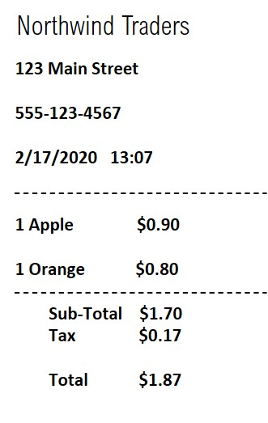

---
lab:
  title: Esplorare la funzionalità di riconoscimento dei moduli
---

# Esplorare la funzionalità di riconoscimento dei moduli

> **Nota:** per completare questo lab è necessaria una [sottoscrizione di Azure](https://azure.microsoft.com/free?azure-portal=true) in cui si ha accesso amministrativo.

Nel campo della visione artificiale dell'intelligenza artificiale, il riconoscimento ottico dei caratteri (OCR) viene comunemente usato per leggere documenti stampati o scritti a mano. Spesso, il testo viene semplicemente estratto dai documenti in un formato che può essere usato per ulteriori elaborazioni o analisi.

Uno scenario OCR più avanzato è l'estrazione di informazioni dai moduli, ad esempio ordini di acquisto o fatture, con una comprensione semantica dei campi rappresentati nel modulo. Il servizio **Riconoscimento modulo** è progettato in modo specifico per questo tipo di problema di intelligenza artificiale.

Riconoscimento modulo usa modelli di Machine Learning sottoposti a training per estrarre testo da immagini di fatture, ricevute e altro ancora. Mentre altri modelli di visione artificiale possono acquisire testo, Riconoscimento modulo acquisisce anche la struttura del testo, ad esempio coppie chiave/valore e informazioni nelle tabelle. In questo modo, invece di dover digitare manualmente le voci da un modulo in un database, è possibile acquisire automaticamente le relazioni tra il testo dal file originale. 

Per testare le funzionalità del servizio Riconoscimento modulo, verrà usata una semplice applicazione da riga di comando eseguita in Cloud Shell. Gli stessi principi e funzionalità sono applicabili a soluzioni reali, ad esempio siti Web o app per smartphone.

## Creare una risorsa *Servizi di Azure AI*

È possibile usare il servizio Riconoscimento modulo creando una risorsa **Riconoscimento modulo** o una risorsa **Servizi di Azure AI**.

Se non è già stato fatto, creare una risorsa **Servizi di Azure AI** nella sottoscrizione di Azure.

1. In un'altra scheda del browser, aprire il portale di Azure all'indirizzo [https://portal.azure.com](https://portal.azure.com?azure-portal=true), eseguendo l'accesso con l'account Microsoft.

1. Fare clic sul pulsante **&#65291;Crea una risorsa** e cercare *Servizi di Azure AI*. Selezionare **Crea** un piano di **Servizi di Azure AI**. Verrà visualizzata una pagina per creare una risorsa Servizi di Azure AI. Eseguire la configurazione con le seguenti impostazioni:
    - **Sottoscrizione**: *la sottoscrizione di Azure usata*.
    - **Gruppo di risorse**: *selezionare o creare un nuovo gruppo di risorse con un nome univoco*.
    - **Area**: *scegliere una qualsiasi area disponibile*.
    - **Nome**: *immettere un nome univoco*.
    - **Piano tariffario**: Standard S0.
    - **Selezionando questa casella, confermo di aver letto e compreso tutte le condizioni seguenti**: selezionata.

1. Esaminare e creare la risorsa e attendere il completamento della distribuzione. Passare quindi alla risorsa distribuita.

1. Visualizzare la pagina **Chiavi ed endpoint** per la risorsa Servizi di Azure AI. Sarà necessario specificare l'endpoint e le chiavi per la connessione dalle applicazioni client.

## Eseguire Cloud Shell

Per testare le funzionalità del servizio Riconoscimento modulo, verrà usata una semplice applicazione da riga di comando eseguita in Cloud Shell in Azure. 

1. Nel portale di Azure, selezionare il pulsante **[>_]** (*Cloud Shell*) nella parte superiore della pagina a destra della casella di ricerca. Si aprirà un riquadro di Cloud Shell nella parte inferiore del portale. 

    

1. La prima volta che si apre Cloud Shell, è possibile che venga chiesto di scegliere il tipo di shell da usare (*Bash* o *PowerShell*). Selezionare **PowerShell**. Se questa opzione non viene visualizzata, ignorare il passaggio.  

1. Se viene chiesto di creare una risorsa di archiviazione per Cloud Shell, assicurarsi che sia specificata la sottoscrizione corretta e selezionare **Crea risorsa di archiviazione**. Attendere circa un minuto che la risorsa di archiviazione venga creata.

    

1. Verificare che nella parte superiore sinistra del riquadro di Cloud Shell sia impostato *PowerShell* come tipo di shell. Se è *Bash*, passare a *PowerShell* usando il menu a discesa.

     

1. Attendere l'avvio di PowerShell. Nel portale di Azure verrà visualizzata la schermata seguente:  

     

## Configurare ed eseguire un'applicazione client

Ora che si dispone di un modello personalizzato, è possibile eseguire una semplice applicazione client che usa il servizio Riconoscimento modulo.

1. Nella shell dei comandi immettere il comando seguente per scaricare l'applicazione di esempio e salvarla in una cartella denominata ai-900.

    ```PowerShell
    git clone https://github.com/MicrosoftLearning/AI-900-AIFundamentals ai-900
    ```

    >**Suggerimento:** se questo comando è già stato usato in un altro lab per clonare il repository *ai-900*, è possibile ignorare questo passaggio.

1. I file vengono scaricati in una cartella denominata **ai-900**. Ora si vogliono visualizzare tutti i file disponibili nella risorsa di archiviazione di Cloud Shell e usarli. Digitare il comando seguente nella shell:

    ```PowerShell
    code .
    ```

    Si aprirà un editor come quello illustrato nell'immagine seguente: 

    

1. Nel riquadro **File** a sinistra espandere **ai-900** e selezionare **form-recognizer.ps1**. Questo file contiene codice che usa il servizio Riconoscimento modulo per analizzare i campi in una ricevuta, come illustrato di seguito:

    

1. Non preoccuparsi troppo dei dettagli del codice, l'aspetto importante è che sono necessari l'URL dell'endpoint e una delle chiavi per la risorsa Servizi di Azure AI. Copiare questi valori dalla pagina **Chiavi ed endpoint** per la risorsa dal portale di Azure e incollarli nell'editor di codice, sostituendo rispettivamente i valori segnaposto **YOUR_KEY** e **YOUR_ENDPOINT**.

    > **Suggerimento:** potrebbe essere necessario usare la barra di separazione per regolare l'area della schermata mentre si usano i riquadri **Chiavi ed endpoint** ed **Editor**.

    Dopo aver incollato i valori della chiave e dell'endpoint, le prime due righe di codice dovrebbero essere simili a quanto segue:

    ```PowerShell
    $key="1a2b3c4d5e6f7g8h9i0j...."    
    $endpoint="https..."
    ```

1. In alto a destra nel riquadro dell'editor fare clic sul pulsante **...** per aprire il menu e selezionare **Salva** per salvare le modifiche. Aprire di nuovo il menu e selezionare **Chiudi Editor**. Dopo aver configurato la chiave e l'endpoint, è possibile usare la risorsa per analizzare i campi da una ricevuta. In questo caso, si userà il modello predefinito di Riconoscimento modulo per analizzare una ricevuta per la società fittizia di vendita al dettaglio Northwind Traders.

    L'applicazione client di esempio analizzerà l'immagine seguente:

    

1. Nel riquadro di PowerShell immettere i comandi seguenti per eseguire il codice per la lettura del testo:

    ```PowerShell
    cd ai-900
    ./form-recognizer.ps1
    ```

1. Esaminare i risultati restituiti. Si noti che Riconoscimento modulo è in grado di interpretare i dati nel modulo, identificando correttamente l'indirizzo e il numero di telefono del commerciante, nonché la data e l'ora della transazione, oltre alle singole voci, il subtotale, le imposte e gli importi totali.

## Altre informazioni

Questa semplice app mostra solo alcune delle funzionalità di Riconoscimento modulo del servizio Visione artificiale. Per altre informazioni su cosa è possibile fare con questo servizio, vedere la [pagina del servizio Riconoscimento modulo](https://docs.microsoft.com/azure/applied-ai-services/form-recognizer/overview).
