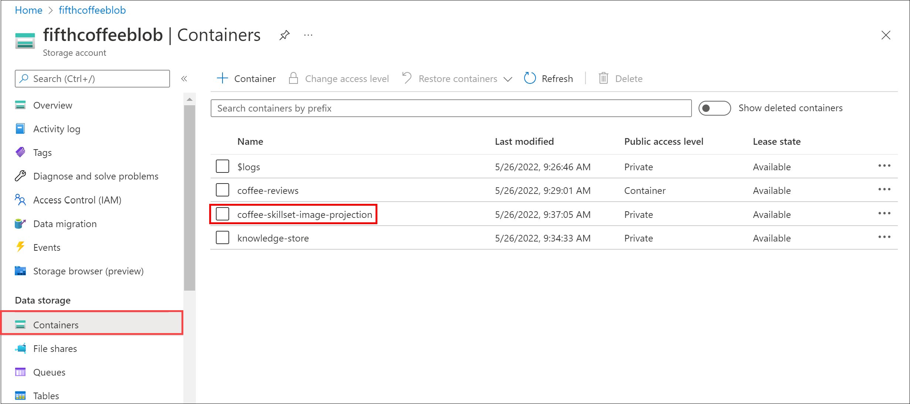
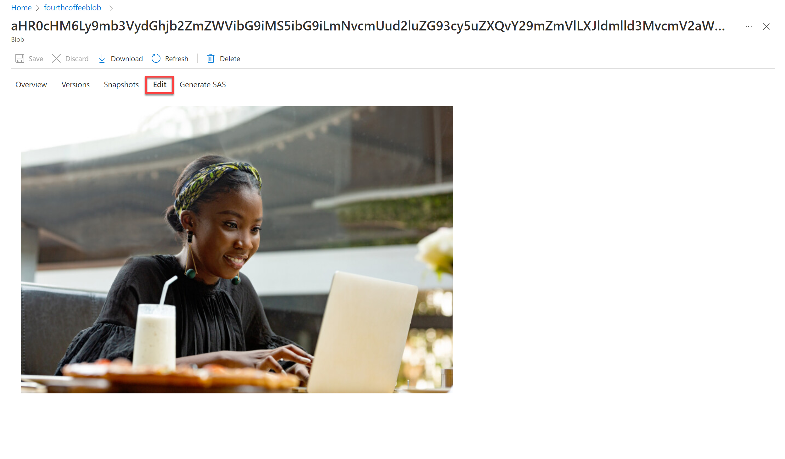

---
lab:
  title: Esplorare la funzionalità di knowledge mining
---

# Esplorare la funzionalità di knowledge mining

> **Nota** Per completare questo lab, è necessaria una [sottoscrizione di Azure](https://azure.microsoft.com/free?azure-portal=true) in cui si ha accesso amministrativo.

Si supponga di lavorare per Fourth Coffee, una catena nazionale di caffetterie. Viene chiesto di creare una soluzione di Knowledge Mining che semplifichi la ricerca di informazioni dettagliate sulle esperienze dei clienti. Si decide di creare un indice di Ricerca cognitiva di Azure usando i dati estratti dalle recensioni dei clienti.  

In questo lab si eseguiranno le operazioni seguenti:

- Creare risorse Azure
- Estrazione dei dati da un'origine dati
- Arricchimento dei dati con competenze di intelligenza artificiale
- Uso dell'indicizzatore di Azure nel portale di Azure
- Query sull'indice di ricerca
- Revisione dei risultati salvati in un archivio conoscenze

## Risorse di Azure necessarie

La soluzione che verrà creata per Fourth Coffe richiede le risorse seguenti nella sottoscrizione di Azure:

- Una risorsa di **Ricerca cognitiva di Azure**, che gestirà l'indicizzazione e l'esecuzione di query.
- Una **risorsa dei servizi** di intelligenza artificiale di Azure, che fornisce servizi di intelligenza artificiale per competenze che la soluzione di ricerca può usare per arricchire i dati nell'origine dati con informazioni dettagliate generate dall'intelligenza artificiale.

    > **Nota** Le risorse dei servizi di intelligenza artificiale di Azure e Ricerca cognitiva di Azure devono trovarsi nella stessa posizione.

- Un **account di archiviazione** con contenitori BLOB, in cui verranno archiviati documenti non elaborati e altre raccolte di tabelle, oggetti o file.

### Creare una risorsa di *Ricerca cognitiva di Azure*

1. Accedere al [portale di Azure](https://portal.azure.com/learn.docs.microsoft.com?azure-portal=true).

1. Fare clic sul pulsante **+ Crea una risorsa**, cercare *Ricerca cognitiva di Azure* e creare una risorsa di **Ricerca cognitiva di Azure** con le impostazioni seguenti:

    - **Sottoscrizione**: *la sottoscrizione di Azure usata*.
    - **Gruppo di risorse**: *selezionare o creare un nuovo gruppo di risorse con un nome univoco*.
    - **Nome del servizio**: *un nome univoco*.
    - **Posizione**: *scegliere una qualsiasi area disponibile*.
    - **Piano tariffario**: Basic

1. Selezionare **Rivedi e crea** e, dopo aver visualizzato la risposta **Convalida completata**, selezionare **Crea**.

1. Al completamento della distribuzione, selezionare **Vai alla risorsa**. Nella pagina di panoramica di Ricerca cognitiva di Azure è possibile aggiungere indici, importare dati e cercare gli indici creati.

### Creare una risorsa dei servizi di intelligenza artificiale di Azure

Sarà necessario effettuare il provisioning di una **risorsa dei servizi** di intelligenza artificiale di Azure che si trova nella stessa posizione della risorsa Ricerca cognitiva di Azure. La soluzione di ricerca userà questa risorsa per arricchire i dati nell'archivio dati con informazioni dettagliate generate dall'intelligenza artificiale.

1. Tornare alla home page del portale di Azure. Fare clic sul **&#65291; Creare un pulsante di risorsa e cercare i servizi* di intelligenza** artificiale di *Azure. Selezionare **Crea** un **piano di servizi** di intelligenza artificiale di Azure. Verrà visualizzata una pagina per creare una risorsa dei servizi di intelligenza artificiale di Azure. Configurarlo con le impostazioni seguenti:
    - **Sottoscrizione**: *la sottoscrizione di Azure usata*.
    - **Gruppo di risorse**: *lo stesso gruppo di risorse della risorsa di Ricerca cognitiva di Azure*.
    - **Area**: *la stessa posizione della risorsa di Ricerca cognitiva di Azure*.
    - **Nome**: *un nome univoco*.
    - **Piano tariffario**: Standard S0
    - **Selezionando questa casella, confermo di aver letto e compreso tutte le condizioni seguenti**: selezionata

1. Selezionare **Rivedi e crea**. Dopo aver visualizzato la risposta **Convalida superata**, selezionare **Crea**.

1. Attendere il completamento della distribuzione, quindi visualizzare i relativi dettagli.

### Creare un account di archiviazione

1. Tornare alla home page del portale di Azure e quindi selezionare il pulsante **+ Crea una risorsa**.

1. Cercare *account di archiviazione* e creare una risorsa di **Account di archiviazione** con le impostazioni seguenti:
    - **Sottoscrizione**: *la sottoscrizione di Azure usata*.
    - **Gruppo** di risorse: *lo stesso gruppo di risorse delle risorse* Ricerca cognitiva di Azure e dei servizi di intelligenza artificiale di Azure.
    - **Nome account di archiviazione**: *un nome univoco*.
    - **Posizione**: *scegliere una delle posizioni disponibili*.
    - **Prestazioni**: standard
    - **Ridondanza**: archiviazione con ridondanza locale

1. Fare clic su **Rivedi** e quindi su **Crea**. Attendere il completamento della distribuzione e quindi passare alla risorsa distribuita.

1. Nell'account Archiviazione di Azure creato, nel riquadro del menu a sinistra selezionare **Configurazione** (in **Impostazioni**).
1. Modificare l'impostazione *Consenti l'accesso* anonimo blob su **Abilitato** e quindi selezionare **Salva**.

## Caricare documenti in Archiviazione di Azure

1. Nel riquadro del menu a sinistra selezionare **Contenitori**.

    

1. Selezionare **+ Contenitore**. Viene aperto un riquadro sulla destra.

1. Immettere le impostazioni seguenti e quindi fare clic su **Crea**:
    - **Nome**: coffee-reviews  
    - **Livello di accesso pubblico**: Contenitore (accesso in lettura anonimo per contenitori e BLOB)
    - **Avanzate**: *nessuna modifica*.

1. In una nuova scheda del browser scaricare i documenti compressi da https://aka.ms/km-documents e quindi estrarre i file nella cartella *reviews*.

1. Nel portale di Azure selezionare il contenitore *coffee-reviews*. Nel contenitore selezionare **Carica**.

    

1. Nel riquadro **Carica BLOB** selezionare **Seleziona un file**.

1. Nella finestra di esplorazione selezionare **tutti** i file nella cartella *reviews*, selezionare **Apri** e quindi selezionare **Carica**.

    

1. Al termine del caricamento è possibile chiudere il riquadro **Carica BLOB**. I documenti si trovano ora nel contenitore di archiviazione *coffee-reviews*.

## Indicizzare i documenti

Quando i documenti sono nella risorsa di archiviazione, è possibile usare Ricerca cognitiva di Azure per estrarre informazioni dettagliate dai documenti. Il portale di Azure fornisce una *procedura guidata Importa dati*. Grazie a questa procedura guidata è possibile creare automaticamente un indice e un indicizzatore per le origini dati supportate. Si userà la procedura guidata per creare un indice e importare i documenti di ricerca dalla risorsa di archiviazione all'indice di Ricerca cognitiva di Azure.

1. Nel portale di Azure passare alla risorsa di Ricerca cognitiva di Azure. Nella pagina **Panoramica** selezionare **Importa dati**.

    

1. Nella pagina **Definisci la connessione ai dati** selezionare **Archiviazione BLOB di Azure** nell'elenco **Origine dati**. Completare i dettagli dell'archivio dati con i valori seguenti:
    - **Origine dati**: Archiviazione BLOB di Azure
    - **Nome origine dati**: coffee-customer-data
    - **Dati da estrarre**: contenuto e metadati
    - **Modalità di analisi**: impostazione predefinita
    - **Stringa di connessione**: *selezionare **Scegliere una connessione esistente**. Selezionare l'account di archiviazione, selezionare il contenitore **coffee-reviews** e quindi fare clic su **Seleziona**.
    - **Autenticazione identità gestita**: Nessuna
    - **Nome contenitore**: *questa impostazione viene popolata automaticamente dopo aver scelto una connessione esistente*.
    - **Cartella BLOB**: *lasciare vuoto questo campo*.
    - **Descrizione**: Reviews for Fourth Coffee shops.

1. Selezionare **Avanti: Aggiungi competenze cognitive (facoltativo)**.

1. Nella **sezione Collegare Servizi** cognitivi selezionare la risorsa dei servizi di intelligenza artificiale di Azure.  

1. Nella sezione **Aggiungi arricchimenti**:
    - Modificare il **Nome del set di competenze** in **coffee-skillset**.
    - Selezionare la casella di controllo **Abilita OCR e unisci tutto il testo nel campo merged_content**.
        > **Nota** È importante selezionare **Abilita OCR** per visualizzare tutte le opzioni dei campi arricchiti.
    - Assicurarsi che il **Campo dei dati di origine** sia impostato su **merged_content**.
    - Impostare **Livello di granularità dell'arricchimento** su **Pagine (blocchi da 5000 caratteri)**.
    - Non selezionare *Abilita arricchimento incrementale*
    - Selezionare i campi arricchiti seguenti:

        | Competenza cognitiva | Parametro | Nome del campo |
        | --------------- | ---------- | ---------- |
        | Estrai nomi di località | | locations |
        | Estrarre le espressioni chiave | | keyphrase |
        | Rileva valutazione | | Valutazione |
        | Genera tag dalle immagini | | imageTags |
        | Genera sottotitoli in altre lingue dalle immagini | | imageCaption |

1. In **Salva arricchimenti in un archivio conoscenze** selezionare:
    - Proiezioni immagini
    - Documenti
    - Pagine
    - Frasi chiave
    - Entità
    - Dettagli immagine
    - Riferimenti alle immagini

    > **Nota** Viene visualizzato un avviso che richiede una **stringa di connessione dell'account di archiviazione**.
    >
    > 
    >
    > 1. Selezionare **Scegliere una connessione esistente**. Scegliere l'account di archiviazione creato in precedenza.
    > 1. Fare clic su + Contenitore** per creare un nuovo contenitore denominato **Knowledge Store** con il livello di privacy impostato su **** Privato** e selezionare **Crea**.
    > 1. Selezionare il contenitore **knowledge-store** e quindi fare clic su **Seleziona** nella parte inferiore della schermata.

1. Selezionare **Proiezioni BLOB di Azure: Documento**. Viene visualizzata un'impostazione *Nome del contenitore* con il contenitore *knowledge-store* popolato automaticamente. Non modificare il nome del contenitore.

1. Selezionare **Avanti: Personalizza indice di destinazione**. Modificare il **Nome indice** in **coffee-index**.

1. Assicurarsi che l'opzione **Chiave** sia impostata su **metadata_storage_path**. Lasciare vuoto **Nome dello strumento suggerimenti** e lasciare **Modalità di ricerca** popolata automaticamente.

1. Esaminare le impostazioni predefinite dei campi dell'indice. Selezionare **Filtrabile** per tutti i campi già selezionati per impostazione predefinita.

    

1. Seleziona **Successivo: Crea un indicizzatore**.

1. Modificare il **Nome indicizzatore** in **coffee-indexer**.

1. Lasciare la **Pianificazione** impostata su **Una volta**.

1. Espandere le **opzioni Avanzate**. Assicurarsi che sia selezionata l'opzione **Chiavi di codifica Base 64** perché le chiavi di codifica possono rendere l'indice più efficiente.

1. Selezionare **Invia** per creare l'origine dati, il set di competenze, l'indice e l'indicizzatore. L'indicizzatore viene eseguito automaticamente ed esegue la pipeline di indicizzazione, che:
    - Estrae il contenuto e i campi dei metadati del documento dall'origine dati.
    - Esegue il set di competenze cognitive per generare campi più arricchiti.
    - Esegue il mapping all'indice dei campi estratti.

1. Nella metà inferiore della pagina **Panoramica** della risorsa di Ricerca cognitiva di Azure selezionare la scheda **Indicizzatori**. Questa scheda mostra l'indicizzatore **coffee-indexer** appena creato. Attendere un minuto e selezionare **&orarr; Aggiorna** finché **Stato** non indica l'esito positivo.

1. Selezionare il nome dell'indicizzatore per visualizzare altri dettagli.

    

## Eseguire una query sull'indice

Usare Esplora ricerche per scrivere e testare le query. Esplora ricerche è uno strumento integrato nel portale di Azure, che offre un modo semplice per convalidare la qualità dell'indice di ricerca. È possibile usare Esplora ricerche per scrivere le query ed esaminare i risultati in JSON.

1. Nella pagina *Panoramica* del servizio di ricerca selezionare **Esplora ricerche** nella parte superiore della schermata.

   

1. Si noti che l'indice selezionato è l'indice *coffee-index* creato.

    

    Immettere `search=*&$count=true` nel campo **Stringa di query** e quindi selezionare **Cerca**. La query di ricerca restituisce tutti i documenti nell'indice di ricerca, incluso un conteggio di tutti i documenti nel campo **@odata.count**. L'indice di ricerca dovrebbe restituire un documento JSON contenente i risultati della ricerca.

    > **Nota** Se viene visualizzato il messaggio **Per eseguire ricerche nel portale, consentire l'origine del portale nelle impostazioni CORS dell'indice**, selezionare **Consenti portale** e quindi selezionare **Cerca**.

1. È il momento di applicare un filtro in base alla località. Immettere `search=locations:'Chicago'` nel campo **Stringa di query** e quindi selezionare **Cerca**. La query cerca tutti i documenti nell'indice e filtra le recensioni con località Chicago.

1. È il momento di applicare un filtro in base al sentiment. Immettere `search=sentiment:'negative'` nel campo **Stringa di query** e quindi selezionare **Cerca**. La query cerca tutti i documenti nell'indice e filtra le recensioni con sentiment negativo.

   > **Nota** Notare come i risultati vengono ordinati in base a `@search.score`. Questo è il punteggio assegnato dal motore di ricerca per visualizzare il livello di corrispondenza dei risultati rispetto alla query specificata.

1. Uno dei potenziali problemi da risolvere è il perché di determinate recensioni. Si esamineranno ora le frasi chiave associate alla recensione negativa. Quale si ritiene che possa essere il motivo della recensione?

## Esaminare l'archivio conoscenze

È il momento di esaminare le potenzialità dell'archivio conoscenze. Quando è stata eseguita la *procedura guidata Importa dati*, è stato creato anche un archivio conoscenze. All'interno dell'archivio conoscenze i dati arricchiti estratti dalle competenze di intelligenza artificiale sono conservati sotto forma di proiezioni e tabelle.

1. Nel portale di Azure tornare all'account di archiviazione di Azure.

1. Nel riquadro del menu a sinistra selezionare **Contenitori**. Selezionare il contenitore **knowledge-store**.

    

1. Selezionare uno degli elementi e quindi fare clic sul file **objectprojection.json**.

    

1. Selezionare **Modifica** per visualizzare il codice JSON generato per uno dei documenti dall'archivio dati di Azure.

    

1. Selezionare il percorso di navigazione del BLOB di archiviazione nella parte superiore sinistra della schermata per tornare all'account di archiviazione *Contenitori*.

    

1. In *Contenitori* selezionare il contenitore *coffee-skillset-image-projection*. Selezionare uno degli elementi.

    

1. Selezionare uno dei file con estensione *jpg*. Selezionare **Modifica** per visualizzare l'immagine archiviata nel documento. Si noti che tutte le immagini dei documenti vengono archiviate in questo modo.

    

1. Selezionare il percorso di navigazione del BLOB di archiviazione nella parte superiore sinistra della schermata per tornare all'account di archiviazione *Contenitori*.

1. Selezionare **Browser archiviazione** nel pannello a sinistra e selezionare **Tabelle**. È presente una tabella per ogni entità dell'indice. Selezionare la tabella *coffeeSkillsetKeyPhrases*.

    Esaminare le frasi chiave che l'archivio conoscenze è riuscito ad acquisire dal contenuto delle recensioni. Molti dei campi sono chiavi, quindi è possibile collegare le tabelle come in un database relazionale. L'ultimo campo mostra le frasi chiave estratte dal set di competenze.

## Altre informazioni

Questo semplice indice di ricerca rappresenta solo alcune delle funzionalità del servizio Ricerca cognitiva di Azure. Per altre informazioni su cosa è possibile fare con questo servizio, vedere la [pagina del servizio Ricerca cognitiva di Azure](/azure/search/search-what-is-azure-search).
